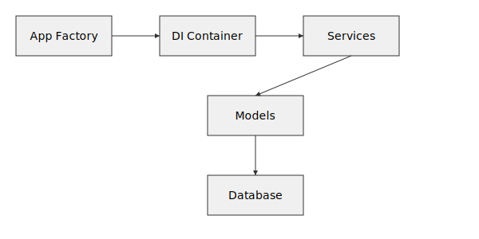

# Yōsai Intel Dashboard

[](https://github.com/WSG23/yosai_intel_dashboard_fresh/actions/workflows/ci.yml)
[](https://github.com/WSG23/yosai_intel_dashboard_fresh/actions/workflows/ci-cd.yml)
[](https://codecov.io/gh/WSG23/yosai_intel_dashboard_fresh)

An AI-powered modular security intelligence dashboard for physical access control monitoring.

## Architecture Overview

This project follows a fully modular design built around a dependency injection container.  Detailed diagrams explain how the pieces fit together:

- [Architecture](docs/architecture.md)
- [Data Flow](docs/data_flow.md)
- [System Diagram](docs/system_diagram.md)
- [Deployment Diagram](docs/deployment_diagram.md)
- [Analytics Upload Sequence](docs/analytics_sequence.md)
- [Roadmap](docs/roadmap.md)
- [Unified Platform](docs/unified_platform.md)
- [Sequence Diagrams](docs/sequence_diagrams.md)
- [UI Flows](docs/ui_flows.md)
- [Upload Interface Guide](docs/upload_interface.md)
- [UI Accessibility](docs/ui_accessibility.md)
- [Integration Guide](docs/integration-guide.md)
- [UI Design Assets](docs/ui_design/README.md)
- [React Component Architecture](docs/react_component_architecture.md)
- [Validation Overview](docs/validation_overview.md)
- [Error Response Contract](docs/error_contract.md)
- [Error Handling](docs/error_handling.md)
- [Model Cards](docs/model_cards.md)
- [Data Versioning](docs/data_versioning.md)
- [Data Processing](docs/data_processing.md)
- [Database Schema](docs/database_schema.md)
- [Column Verification](docs/column_verification.md)
- [Service Container](docs/service_container.md)
- [Distributed State Management](docs/distributed_state.md)
- [Testing Architecture](docs/test_architecture.md)
- [Comprehensive Testing Strategy](docs/comprehensive_testing_strategy.md)
- [Service Mesh Evaluation](docs/service_mesh_evaluation.md)
- [Internal Service Interfaces](docs/internal_services.md)
- [Analytics Async Service](docs/analytics_async_migration.md)
- [Feature Store](docs/feature_store.md)
- [Async Patterns](docs/async_patterns.md)
- [API Adapter](docs/api.md)

<p align="center">
  
</p>

Core service protocols live in `services/interfaces.py`. Components obtain
implementations from the `ServiceContainer` when an explicit instance is not
provided, allowing tests to supply lightweight mocks. See
[docs/service_container.md](docs/service_container.md) for registration
patterns and lifetime options.

The dashboard is extensible through a lightweight plugin system. Plugins live in the `plugins/` directory and are loaded by a `PluginManager`. See [docs/plugins.md](docs/plugins.md) for discovery, configuration details and a simple **Hello World** example. The [plugin lifecycle diagram](docs/plugin_lifecycle.md) illustrates how plugins are discovered, dependencies resolved and health checks performed. Pass `fail_fast=True` to the manager if plugin import failures should abort startup instead of merely being logged.

```
yosai_intel_dashboard/
├── start_api.py               # Start the API for development
├── config/                    # Configuration management
│   ├── config.py              # Unified configuration loader
│   ├── database_manager.py    # Database connections and pooling
│   └── cache_manager.py       # Simple cache interface
├── models/                    # Data models and business entities
│   ├── base.py               # Base model classes
│   ├── entities.py           # Core entities (Person, Door, Facility)
│   ├── events.py             # Event models (AccessEvent, Anomaly)
│   ├── enums.py              # Enumerated types
│   └── access_events.py      # Access event operations
├── services/                  # Business logic layer
│   └── analytics_service.py  # Analytics and data processing
├── components/               # UI components
│   ├── analytics/            # Analytics-specific components
│   ├── ui/                   # Shared UI components
│   └── map_panel.py          # Map visualization
├── utils/                    # Utility functions
└── assets/                   # Static assets and CSS
    └── css/                  # Modular CSS architecture
```

### Navbar Icons

The navigation bar now uses **FontAwesome** icons by default. PNG images in
`assets/navbar_icons/` are optional and primarily used by the `get_simple_icon`
helper or the debug utilities. Common filenames referenced by the debug tool
include:

* `analytics.png`
* `graphs.png`
* `export.png`
* `upload.png`
* `print.png`
* `settings.png`
* `logout.png`

Run the debug helper to verify that PNG icons exist and can be served:

```bash
python -m tools.debug assets
```

You can override the default links and icons when creating the navbar:

```python
from components.ui.navbar import create_navbar_layout

links = [('/admin', 'Admin'), ('/reports', 'Reports')]
icons = ['fa-user-shield', 'fa-file-alt']
navbar = create_navbar_layout(links=links, icons=icons)
```

Pass icon names after the command to check custom files.

## <span aria-hidden="true">🚀</span> Quick Start

### Development Setup

Python 3.8 or later is required. All pinned dependency versions are compatible
with this Python release and newer.

1. **Clone and enter the project:**
   ```bash
   git clone <repository>
   cd yosai_intel_dashboard
   ```

2. **Create virtual environment:**
   ```bash
   python -m venv venv
   source venv/bin/activate  # On Windows: venv\Scripts\activate
   ```

3. **Install Python dependencies:**
   ```bash
   ./scripts/setup.sh
   ```
   The script installs `requirements.txt`, `requirements-dev.txt`, and
   `requirements-test.txt` from PyPI (or a local `packages/` directory if
   present) and runs `npm install` to
   fetch Node dependencies. The Python requirements now include the Kafka
   clients `confluent-kafka` and `fastavro`. Ensure dependencies are installed
   **before** running Pyright or using the Pylance extension. Missing packages
   will otherwise appear as unresolved imports.

4. **Install Node dependencies (optional):**
   PostCSS and other build tools live in `package.json`. `./scripts/setup.sh`
   already runs `npm install`, but you can execute it manually if desired.
   ```bash
   npm install
   ```
5. **Set up environment:**
   ```bash
    cp .env.example .env
    # Generate random development secrets
    python scripts/generate_dev_secrets.py >> .env
    # Edit .env with your configuration (e.g. set HOST and database info)
    # or store them in Vault
    vault kv put secret/data/yosai \
      SECRET_KEY=$(openssl rand -base64 32) \
      DB_PASSWORD=my-db-pass \
      AUTH0_CLIENT_ID=my-id \
      AUTH0_CLIENT_SECRET=my-secret \
      AUTH0_DOMAIN=example.auth0.com \
      AUTH0_AUDIENCE=https://api.example.com
    ```
`setup_dev_mode` checks for the `DB_PASSWORD` variable. The sample
`.env.example` includes a placeholder value. If this variable is
missing only a warning is emitted on startup, but database features
may not function.

`SECRET_KEY` **must** be defined. The API will exit with a
`RuntimeError` if the variable is missing.

### Required Environment Variables

The application reads configuration from `.env` or your shell before
startup. Ensure the following variables are set:

- `SECRET_KEY` – session signing key
- `DB_PASSWORD` – database user password
- `AUTH0_CLIENT_ID`
- `AUTH0_CLIENT_SECRET`
- `AUTH0_DOMAIN`
- `AUTH0_AUDIENCE`
- `JWT_SECRET` – microservice authentication secret

`DB_HOST`, `DB_USER` and `DB_NAME` can also be overridden if they differ
from the defaults. For production deployments store these secrets in
HashiCorp Vault or AWS Secrets Manager as described in
[docs/secret_management.md](docs/secret_management.md). Vault deployment
details are provided in [docs/vault_integration.md](docs/vault_integration.md).
Whenever possible set these values through environment variables or your
secret management solution rather than hard coding them.

#### Frontend WebSocket URL

Set `REACT_APP_WS_URL` to override the host used for WebSocket connections.
When unset the front end falls back to `window.location.host`.

### RBAC Setup

Apply the initial database schema before enabling role based access
control:

```bash
python scripts/db_migration_cli.py upgrade  # create RBAC tables
python scripts/db_migration_cli.py current  # verify current revision
```

Set the permission service URL in your environment if it differs from
`http://localhost:8081`:

```bash
export PERMISSION_SERVICE_URL="http://rbac-service:8081"
```

Test the service with a simple request:

```bash
curl "$PERMISSION_SERVICE_URL/permissions/check?user_id=alice&resource=door:101&action=open"
```

See [docs/rbac.md](docs/rbac.md) for a full overview of resources,
actions and role assignment.
6. **Build the CSS bundle:**
   Ensure `node` and `npm` are available if you use the npm command.
   ```bash
   npm run build-css  # or `python tools/build_css.py`
   ```
   The command generates `assets/dist/main.css`, `assets/dist/main.min.css` and
   `assets/dist/main.min.css.map`. These files are auto-generated and should not
   be edited directly. Modify source files under `assets/css/` and rerun the
   build when needed.

7. **Run the application (development only):**
   The app now loads variables from `.env` automatically.
   ```bash
   python start_api.py  # use only for local development
   ```
   For production deployments start a WSGI server instead:
   ```bash
   gunicorn wsgi:server
   # or
   uwsgi --module wsgi:server
   ```
8. **Access the dashboard:**
   Open http://127.0.0.1:8050 in your browser.
   The server runs over HTTP by default but will automatically serve HTTPS
   whenever certificates are available.

### Docker Compose Development Environment

To spin up the microservices stack run:

```bash
docker-compose \
  -f docker-compose.yml \
  -f docker-compose.kafka.yml \
  -f docker-compose.dev.yml up --build
```

`start.sh` reads variables from `.env` before launching the server. Ensure the
file exists or pass the required values via `--env-file` when running the
container. If you override the default command in Docker Compose, invoke
`./start.sh` so the variables are loaded correctly.

web UI on `http://localhost:8080`, pgAdmin on `http://localhost:5050`, and the API gateway on `http://localhost:8081`.

### Go API Gateway

The source code for the gateway lives under the `gateway/` directory.

The gateway forwards all requests to the dashboard service. At startup it
uses service discovery to resolve the analytics service address and sets the
`APP_HOST` and `APP_PORT` variables automatically when found. Additional
middleware can be toggled with:


* `ENABLE_AUTH=1` – require an `Authorization` header
* `ENABLE_RATELIMIT=1` – enable a simple token bucket rate limiter
* `RATE_LIMIT_BUCKET` – maximum number of tokens in the bucket (default 10)
* `RATE_LIMIT_INTERVAL_MS` – token refill interval in milliseconds (default 100)

Run it locally with:

```bash
cd gateway
go run ./cmd/gateway
```

The service listens on port `8080` inside the container. You can reach it at
`http://localhost:8081` when running via Docker Compose.
Stop all containers with `docker-compose down` when finished.

### Unified Local Stack

To launch all Python and Go services along with Jaeger, Prometheus, Grafana and Loki run:

```bash
docker compose -f docker-compose.unified.yml up --build
```

Prometheus will listen on [localhost:9090](http://localhost:9090) and Grafana on [localhost:3000].
The file mounts `monitoring/prometheus.yml` and the `unified-platform.json` dashboard
under `monitoring/grafana/dashboards/` so metrics are available immediately.
Stop the stack with `docker compose down` when done.

### Unified Operations CLI

Common project tasks can be executed via the unified operations CLI or the
provided Makefile wrappers:

```bash
# validate configuration and secrets
make validate

# build Docker images and start the stack
make build
make deploy

# run tests and checks
make test
make lint
make format

# regenerate deprecation documentation
make deprecation-docs

# tear everything down and clean caches
make clean
```

Updates to component lifecycle should be recorded in `deprecation.yml`. Run
`make deprecation-docs` whenever this file changes.

### Kafka Event Processor

The gateway starts a Kafka-based `EventProcessor` for publishing `AccessEvent`
messages. Configure brokers via `KAFKA_BROKERS` (defaults to `localhost:9092`).
The processor shuts down gracefully together with the gateway service.

## Developer Onboarding

For a more detailed walkthrough of the environment setup and testing workflow,
see [developer_onboarding.md](docs/developer_onboarding.md).

### Troubleshooting

If Pylance shows unresolved imports or type errors, your editor may not be
using the virtual environment where dependencies were installed. Try the
following steps:

1. Activate the virtual environment:
   ```bash
   source venv/bin/activate  # On Windows: venv\Scripts\activate
   ```

2. Install dependencies:
   ```bash
   ./scripts/setup.sh
   ```
   The script installs both requirement files. If you encounter errors like
   `module 'flask' has no attribute 'helpers'`,
   ensure there are no local directories named `flask`, `pandas`, or `yaml`
   in the project root. These placeholder packages can shadow the real
   libraries installed from `requirements.txt`. Delete them before running
   the application.

3. Restart your editor so Pylance picks up the correct interpreter.

4. If the dashboard starts with a blank page, required packages are
   likely missing. Install them before launching the app:
   ```bash
   pip install -r requirements.txt
   pip install -r requirements-dev.txt
   pip install -r requirements-test.txt
   # or simply run ./scripts/setup.sh
   ```
5. If Dash packages behave unexpectedly, reinstall them with pinned versions:
   ```bash
   pip uninstall -y dash dash-leaflet dash-extensions dash-bootstrap-components
   pip install dash==2.14.1
   pip install dash-bootstrap-components==1.6.0
   pip install dash-extensions==1.0.11
   pip install dash-leaflet==0.1.28
   pip install -r requirements.txt
   ```
6. If you accidentally open the app with `https://` instead of `http://`,
   your browser may cache a service worker or enforce HSTS, preventing the
   plain HTTP version from loading. Use the browser's development settings to
   clear site data, including service workers and caches, and remove any HSTS
   entries before reloading the page.
7. If `python start_api.py` fails with `NameError: name '_env_file_callback' is not defined`,
   Flask was likely installed incorrectly. Reinstall it to restore the missing
   function:
   ```bash
   pip install --force-reinstall "Flask>=2.2.5"
   ```
   See [docs/troubleshooting.md](docs/troubleshooting.md) for details.

### Production Deployment

Using Docker Compose to start the microservices stack:
```bash
docker-compose -f docker-compose.prod.yml up -d
```
The container entrypoint runs `start.sh`, which sources the `.env` file before
launching Gunicorn. Make sure the file exists or supply one via Docker's
`--env-file` option.
When deploying manually or via Kubernetes, execute `start.sh` to ensure
environment variables from `.env` are available to the app.
Whenever you modify the code, rebuild the Docker image with `docker-compose build` (or `docker-compose up --build`) so the running container picks up your changes.
Docker Compose expects the database password and Flask secret key to be
provided via Docker secrets or environment variables. Create
`secrets/db_password.txt` and `secrets/secret_key.txt` locally if you use
file-based Docker secrets, set `DB_PASSWORD` and `SECRET_KEY` in the
environment, or let the `ConfigManager` load them from your secret
backend. **Do not commit these files to version control.**

The gateway and analytics microservice validate several variables on
startup:

- `DB_HOST`, `DB_PORT`, `DB_USER`, `DB_PASSWORD` and `DB_GATEWAY_NAME` for the gateway
- `JWT_SECRET` for service authentication and the analytics microservice
- `SECRET_KEY` for Flask sessions and CSRF protection

### Production Build

Build optimized CSS assets before deployment:
```bash
npm run build-css
```
The script reads `assets/css/main.css` and outputs both
`assets/dist/main.css` and `assets/dist/main.min.css` with a source map
`assets/dist/main.min.css.map`. Any changes under `assets/css/` won't be
reflected until you rebuild the bundle with `npm run build-css` (or
`python tools/build_css.py`). When the minified file exists, the application
loads `assets/dist/main.min.css` instead of the source CSS. Gzip or Brotli
compression is automatically handled at runtime by `flask-compress`.

## Kafka Setup

Kafka topics must exist before starting the streaming service. Use the helper
script to create them (pass the broker list if not running on localhost):

```bash
./scripts/create_kafka_topics.sh            # uses localhost:9092
./scripts/create_kafka_topics.sh kafka:9092 # custom broker
```

The script requires `kafka-topics.sh` and `curl` in your `PATH`. It
creates the topics `access-events`, `access-events-enriched`,
`analytics-requests`, `analytics-responses`, `anomaly-events`,
`alerts`, `system-metrics`, `dead-letter`, `app-state` and
`audit-logs` with sensible defaults. A replication factor of **3** is
used with `min.insync.replicas=2`. The script also registers the Avro
schema in `schemas/access-event.avsc` with your schema registry (set
`SCHEMA_REGISTRY_URL` to override the default `http://localhost:8081`).

## 🧪 Testing

Install dependencies before running the tests:
```bash
# Option 1: use the helper script (installs test requirements as well)
./scripts/setup.sh
# Option 2: install packages manually
pip install -r requirements.txt -r requirements-test.txt
```
Use the provided environment template for tests:
```bash
cp .env.test .env
```
For minimal CI environments you can run `./scripts/install_test_deps.sh` which
only installs the Python dependencies required for the tests.
### Test Requirements

The test suite relies on extra packages defined in `requirements-test.txt`. Installing them ensures that `pytest` can import all helper modules:

- `pytest` and `pytest-cov`
- `PyYAML`
- `pandas`
- `psutil`
- `hvac`
- `cryptography`
- `selenium`
- `requests`

Detailed instructions are provided in
[docs/test_setup.md](docs/test_setup.md).
The overall design of our test protocols and injection approach is
documented in [docs/test_architecture.md](docs/test_architecture.md).

Run the complete test suite:
```bash
# Run all unit and integration tests
pytest

# Run type checking
mypy .

# Check code quality
black . --check
flake8 .
```

The `tests/` directory contains the integration and unit tests for the
dashboard. Key entry points include `tests/test_integration.py`,
`tests/test_analytics_integration.py`, `tests/test_ai_device_generator.py` and
`tests/test_security_service.py`.

Most asynchronous tests rely on a reusable `async_runner` fixture that
executes coroutines on a dedicated event loop. If you need to run an async
function inside a test simply pass `async_runner` and call it with your
coroutine.

The CI workflow also stores the `audit-report.json` file produced by `pip-audit`
as the **pip-audit-report** artifact. It runs on pull requests and fails when
critical vulnerabilities are detected. Download the artifact from the
**Actions** tab to review dependency vulnerability results.

Coverage results are uploaded to **Codecov** for every pull request. Open the
`codecov` check from the PR status page to explore detailed line coverage and
changes introduced by the branch.
The CI pipeline enforces a minimum **80%** coverage threshold using
`--cov-fail-under=80`.

## <span aria-hidden="true">📋</span> Features

- **Real-time Security Monitoring**: Live access control event monitoring
- **AI-Powered Anomaly Detection**: Advanced pattern recognition
- **Interactive Analytics**: Deep dive data analysis with file uploads
- **Automatic Data Summaries**: Charts for numeric distributions and top categories
- **Modular Architecture**: Easy to maintain, test, and extend
- **Multi-page Interface**: Organized functionality across multiple pages
- **Type-Safe**: Full type annotations and validation
- **CSRF Protection Plugin**: Optional production-ready CSRF middleware for Dash
- **Machine-Learned Column Mapping**: Trainable model for smarter CSV header recognition
- **Hardened SQL Injection Prevention**: Uses `sqlparse` and `bleach` to validate queries
- **Centralized Unicode Processing**: now provided by the external
  `unicode_toolkit` package. Import the new helpers such as
  `TextProcessor` and `SQLProcessor` to clean input and safely encode SQL
  statements. See the migration section below for details.
- **Unified Unicode Handler**: the `UnicodeHandler` class delegates to
  `QueryUnicodeHandler` and `FileUnicodeHandler` so all sanitization
  relies on the same `core.unicode` implementation.
- **Event Driven Callbacks**: Plugins react to events via the unified
  `TrulyUnifiedCallbacks` manager.
  This single interface replaces previous callback controllers.
- **Metrics & Monitoring**: `PerformanceMonitor` tracks system performance
  using `psutil`.
- **Dependabot Updates**: Python dependencies automatically kept up-to-date.
- **Unified Error Handling**: Use `core.error_handling` decorators and middleware for consistent logging

**Note:** The file upload and column mapping functionality relies on `pandas`.
If `pandas` is missing these pages will be disabled. Ensure you run
`pip install -r requirements.txt`, `pip install -r requirements-dev.txt` and
`pip install -r requirements-test.txt` to
install all dependencies (or execute `./scripts/setup.sh`).
`PerformanceMonitor` requires `psutil` for CPU and memory metrics, and the
file processing utilities depend on `chardet` to detect text encoding.

## <span aria-hidden="true">🔄</span> Upload Workflow

The upload page now streams files directly to a background task. Progress is
reported via Server‑Sent Events at `/upload/progress/<task_id>`. Once the server
finishes processing a file it updates the `file-info-store` so analytics pages
pick up the new dataset automatically. Mobile users can collapse the queue to
free up space and the workflow adjusts for touch interactions.

## <span aria-hidden="true">📱</span> Mobile Support

The layout is responsive down to narrow phone screens. Navigation collapses into
a hamburger menu and the drag‑and‑drop region expands to full width. All touch
targets meet the 44&nbsp;px guideline and alerts reposition so they remain
readable on mobile devices.

## <span aria-hidden="true">🛠️</span> Monitoring Setup

Runtime metrics are exposed at `/metrics` for Prometheus. A sample configuration
is provided in `monitoring/prometheus.yml`. Logstash support is available via
`logging/logstash.conf`. Dashboards can be built in Grafana or Kibana using
these data sources. See [performance_monitoring.md](docs/performance_monitoring.md)
for details.

### Prometheus Queries

Example Prometheus expressions:

- **Cache hit rate** – percentage of requests served from cache:
  ```promql
  sum(rate(cache_default_hit[5m]))
  /
  (sum(rate(cache_default_hit[5m])) + sum(rate(cache_default_miss[5m]))) * 100
  ```

- **Circuit breaker state** – see how often the circuit is open:
  ```promql
  rate(circuit_breaker_state{state="open"}[5m])
  ```

### Tracing Setup

All services use OpenTelemetry with Jaeger for distributed tracing. Set the
`JAEGER_ENDPOINT` environment variable to the collector endpoint
(`http://localhost:14268/api/traces` by default) before starting a service.

```python
from tracing import init_tracing

init_tracing("my-service")
```

```go
shutdown, _ := tracing.InitTracing("my-service")
defer shutdown(context.Background())
```

This ensures traces from Python and Go components are reported consistently.

### Monitoring Environment Variables

Set the following variables to configure tracing and metrics endpoints:

- `JAEGER_ENDPOINT` – URL of the Jaeger collector (defaults to `http://localhost:14268/api/traces`).
- `REPLICATION_METRICS_PORT` – Port used by `scripts/replicate_to_timescale.py` to expose Prometheus metrics (defaults to `8004`).
- All services expose Prometheus metrics at the `/metrics` endpoint. No additional configuration is required.

## Kafka Setup

`docker-compose.kafka.yml` spins up a three-node Kafka cluster with Schema Registry
and a Kafka UI. A `kafka-init` service automatically creates the required topics.
The helper script `start_kafka.sh` launches the stack and detaches from the terminal:

```bash
./scripts/start_kafka.sh
```

Monitor the brokers at <http://localhost:8080> while services are running.
Run the health check tool to verify that all brokers are reachable:

```bash
python tools/cli_kafka_health.py --brokers localhost:9092
```

Stop the cluster when finished:

```bash
docker-compose -f docker-compose.kafka.yml down
```

Broker data is persisted in named volumes so messages survive container restarts.
The configuration sets a replication factor of **3** and enables health checks
for all components.

## <span aria-hidden="true">⚡</span> Performance Optimization

Upcoming optimizer modules tune analytics batch sizes and cache behavior.
The `CacheManager` selects an in-memory or Redis backend, while dedicated
memory and CPU optimizers keep resource usage within the thresholds described in
[performance_monitoring.md](docs/performance_monitoring.md#upcoming-optimization-tools).
Large uploads are streamed through the `AsyncFileProcessor` to avoid blocking
the event loop.

### Cache Warming

Use `IntelligentCacheWarmer` with a `HierarchicalCacheManager` to prefill
caches during start-up. This avoids expensive database queries on the first
request.

```python
from core.cache_warmer import IntelligentCacheWarmer
from core.hierarchical_cache_manager import HierarchicalCacheManager

cache = HierarchicalCacheManager()
warmer = IntelligentCacheWarmer(cache, loader=load_from_db)

warmer.record_usage("recent_events")
warmer.record_usage("top_users")

await warmer.warm()
```

Calling `ServiceContainer.warm_caches()` runs the warmer automatically if it is
registered with the container.

### Redis Cache Layer

Set `CACHE_TYPE=redis` to store cached results in Redis instead of the
in‑process memory cache. Configure the connection with:

```bash
REDIS_HOST=localhost  # Redis server host
REDIS_PORT=6379       # Redis port
CACHE_TTL_SECONDS=300 # Default TTL for cached analytics
JWKS_CACHE_TTL=300    # TTL for cached JWKS responses
```

Each cached entry is stored with the specified TTL. When running multiple
application instances the Redis backend keeps the caches in sync across all
workers.

You can override TTLs for specific cached endpoints by defining environment
variables of the form `CACHE_TTL_<ENDPOINT_NAME>`. For example:

```bash
CACHE_TTL_ACCESS_EVENTS=60  # 60 second TTL for the access events analytics
```

### Circuit Breaker Settings

The connection pool and error-handling utilities include a circuit breaker to
prevent repeated failures from overwhelming external services. Tune its
behaviour via environment variables:

```bash
CIRCUIT_BREAKER_THRESHOLD=5   # Failures before opening the circuit
CIRCUIT_BREAKER_TIMEOUT=30    # Seconds to wait before retrying requests
```

If the failure count exceeds the threshold, new requests are rejected until the
timeout expires.

## <span aria-hidden="true">🔧</span> Configuration

This project uses **`config/config.py`** for all application settings. The
`create_config_manager()` helper builds a `ConfigManager` composed of modular
dataclasses like `AppConfig`, `DatabaseConfig` and `SecurityConfig`. It loads a
YAML file from `config/` based on `YOSAI_ENV` or `YOSAI_CONFIG_FILE`, then
applies environment variable overrides.
The underlying loading logic lives in `config/base_loader.py` as `BaseConfigLoader`.
It handles YAML `!include` expansion, JSON files and environment variable substitution. Earlier versions used separate modules
such as `app_config.py` and `simple_config.py`; these have been replaced by this
unified loader. The configuration schema is also defined using a protobuf file
(`config/yosai_config.proto`). Loaders compile this schema to the Python module
`yosai_config_pb2.py` and a convenience wrapper called `YosaiConfig`. All
services read YAML/JSON and convert it to this protobuf representation before
use. Register the configuration with the DI container so it can be
resolved from anywhere:


```python
from core.container import Container
from config import create_config_manager

container = Container()
container.register("config", create_config_manager())

config = container.get("config")
```

A short example without the container:

```python
from config import create_config_manager

config = create_config_manager()
db_cfg = config.get_database_config()
```

### Database

Configure your database in `.env`:
```
DB_TYPE=postgresql  # or 'sqlite' or 'mock'
DB_HOST=your_db_host
DB_PORT=5432
DB_NAME=your_db_name
DB_USER=your_db_user
DB_PASSWORD=your_db_password
```

### Application

Key configuration options:
```
DEBUG=False           # Set to False for production
HOST=0.0.0.0         # Bind to all interfaces for production
PORT=8050            # Application port
SECRET_KEY=your-key  # Change for production
```

For Gunicorn deployments, host, port and log level defaults are also
defined in `gunicorn.conf.py`.


The secret key is not included in the default YAML files. **You must**
provide `SECRET_KEY` via an environment variable, Docker secret or your
secret manager (e.g. Vault) before starting the application. The API
raises a `RuntimeError` if the variable is missing.

When `YOSAI_ENV=production` the application will refuse to start unless both
`DB_PASSWORD` and `SECRET_KEY` are provided via environment variables or Docker
secrets.

Configuration validation runs automatically at startup and logs any missing
critical settings. The new `ConfigValidator` checks that the `app`, `database`
and `security` sections exist before the server starts.
See [configuration_reference.md](docs/configuration_reference.md) for a table of
all available settings and their environment variable overrides.

### Environment Overrides

The `ConfigManager` returned by `create_config_manager()` loads YAML files from
`config/` and then checks for environment variables. When a variable name
matches a key used in the YAML configuration (for example `DB_HOST`, `DB_USER`,
`REDIS_HOST` or `SECRET_KEY`), its value replaces the one from the file. This
lets you adjust settings without editing the YAML files.

Example:

```bash
DB_HOST=localhost
DB_USER=postgres
REDIS_HOST=localhost
SECRET_KEY=supersecret
python start_api.py
```

These values override `database.host`, `database.user`, `cache.host` and
`security.secret_key` from the loaded YAML.

### Selecting a YAML File

`create_config_manager()` determines which YAML file to load by inspecting
environment variables:

- `YOSAI_ENV` – set to `development`, `staging`, `production` or `test` to
  automatically load the corresponding file under `config/`.
- `YOSAI_CONFIG_FILE` – absolute path to a custom YAML file. When set it
  overrides `YOSAI_ENV`.
- `YOSAI_APP_MODE` – set to `full`, `simple` or `json-safe` to select the
  startup mode for `create_app()` (default: `full`).

Example:

```bash
YOSAI_ENV=production python start_api.py
# or
YOSAI_CONFIG_FILE=/path/to/custom.yaml python start_api.py
YOSAI_APP_MODE=simple python start_api.py
```

#### Dynamic Constants

`create_config_manager()` uses the internal `DynamicConfigManager` to read
optional environment variables that fine&ndash;tune security and performance
defaults:


- `PBKDF2_ITERATIONS` – password hashing iterations
 - `RATE_LIMIT_REQUESTS` – number of requests allowed per window
- `RATE_LIMIT_WINDOW` – rate limit window in minutes
- `MAX_UPLOAD_MB` – maximum allowed upload size
- `DB_POOL_SIZE` – database connection pool size
- `DB_INITIAL_POOL_SIZE` – starting number of pooled connections
- `DB_MAX_POOL_SIZE` – upper limit for the pool
- `DB_TIMEOUT` – database connection timeout in seconds
- `QUERY_TIMEOUT_SECONDS` – analytics query timeout

### Plugins

Plugins live in the `plugins/` directory. Place any custom plugin package inside
this folder, for example `plugins/my_plugin/plugin.py` defining a
`create_plugin()` function. Enable the plugin by adding a section under
`plugins:` in `config/config.yaml` and setting `enabled: true` plus any plugin
options. Initialize plugins by calling `setup_plugins` from
`core.plugins.auto_config`. This discovers plugins, registers callbacks, exposes
`/health/plugins` and attaches the manager as `app._yosai_plugin_manager`.
See [docs/plugins.md](docs/plugins.md) for a detailed overview of discovery,
configuration and the plugin lifecycle. For step-by-step instructions on
writing your own plugin check [docs/plugin_development.md](docs/plugin_development.md).
For a diagram of the full process see [docs/plugin_lifecycle.md](docs/plugin_lifecycle.md).
The same document includes a minimal **Hello World** plugin showcasing
`create_plugin()` and callback registration.

#### Customizing Plugins

1. Copy the `plugins/example` folder (or any existing plugin) and update the
   `PluginMetadata` values.
2. Add a section under `plugins:` in `config/config.yaml` with `enabled: true`
   and any custom options.
3. Call `setup_plugins` from `core.plugins.auto_config` during app start-up to
   load your plugin and register its callbacks.
4. See [docs/plugin_development.md](docs/plugin_development.md) for a complete
   walkthrough.

### Migration Notes

Older modules `config/app_config.py`, `config/simple_config.py` and the
previous `config_manager.py` have been removed. Create a container and access
the new unified configuration through it instead:

```python
from core.container import Container
from config import create_config_manager

container = Container()
container.register("config", create_config_manager())

config = container.get("config")
```

The `ConfigManager` implements `ConfigurationProtocol` so alternative
implementations can be swapped in for tests. Helper functions like
`get_app_config()` and `get_database_config()` remain available for convenience.

## <span aria-hidden="true">🔄</span> Migration Guide

Unicode handling is now provided by the standalone `unicode_toolkit`
package. Legacy helpers from `core.unicode` remain as thin wrappers
around this library. A convenience `UnicodeHandler` class combines the
file and query utilities so you can migrate incrementally. Detect outdated usage and validate the migration
with the helper tools:

```bash
python tools/validate_unicode_cleanup.py
python tools/validate_unicode_migration.py
python tools/audit_unicode_usage.py
```

The repository also includes a helper for enforcing snake_case names.
Scan the codebase and automatically fix issues with:

```bash
python tools/naming_standardizer.py scan .
python tools/naming_standardizer.py fix <path>
```

See [docs/migration_guide.md](docs/migration_guide.md) for step-by-step
instructions and benefits of the new processors.

## <span aria-hidden="true">📊</span> Plugin Performance Monitoring

Use `EnhancedThreadSafePluginManager` to track plugin load times and
resource usage:

```python
from core.plugins.performance_manager import EnhancedThreadSafePluginManager
manager = EnhancedThreadSafePluginManager(container, config)
data = manager.get_plugin_performance_metrics()
```

The `/v1/plugins/performance` endpoint exposes metrics for dashboards.

## <span aria-hidden="true">📊</span> Modular Components

### Database Layer (`config/`)
- **database_manager.py**: Connection pooling, multiple database support
- Supports PostgreSQL, SQLite, and Mock databases
- Type-safe connection management
- Retry logic via `connection_retry.py` with exponential backoff
 - Safe Unicode handling using `UnicodeSQLProcessor` for queries and
   `UnicodeProcessor` for parameters
- Connection pooling through `connection_pool.py`
```python
from config.database_manager import EnhancedPostgreSQLManager, DatabaseConfig
manager = EnhancedPostgreSQLManager(DatabaseConfig(type="postgresql"))
manager.execute_query_with_retry("SELECT 1")
```

### Models Layer (`models/`)
- **entities.py**: Core business entities
- **events.py**: Event and transaction models
- **enums.py**: Type-safe enumerations
- Full type annotations and validation
- **Guide**: [docs/models_guide.md](docs/models_guide.md) explains each model file

-### Services Layer (`services/`)
- All services rely on `yosai_framework.BaseService` for metrics, tracing and health endpoints.
- **analytics_service.py**: Business logic for analytics ([docs](docs/analytics_service.md))

  Register an instance with the container to access analytics operations:

  ```python
   from core.container import Container
   from services.analytics_service import create_analytics_service

  container = Container()
  container.register("analytics", create_analytics_service())

  analytics = container.get("analytics")
  ```

  The `AnalyticsService` conforms to `AnalyticsServiceProtocol`, so you can
  substitute your own implementation during tests.

  The legacy Flask blueprint has been removed. Use the FastAPI microservice
  endpoints instead.

  Run the analytics microservice via the unified BaseService:

  ```bash
  python -m uvicorn services.analytics_microservice.app:app --host 0.0.0.0 --port 8001
  ```

- **Async analytics microservice**: FastAPI implementation using an async
  database engine and Redis cache
  ([docs](docs/analytics_async_migration.md)).


- **device_learning_service.py**: Persists learned device mappings ([docs](docs/device_learning_service.md))
- **Model predictions**: POST data to `/api/v1/models/{name}/predict` to run the active model and receive predictions
- Caching and performance optimization
- Modular and testable

### Components Layer (`components/`)
- Reusable UI components
- Independent and testable
- Type-safe prop interfaces

### SQL Injection Prevention
Use `SecurityValidator` to sanitize query parameters in both Flask and Dash routes. Example:

```python
from validation.security_validator import SecurityValidator

validator = SecurityValidator()

@app.route('/search')
def search():
    term = request.args.get('q', '')
    validator.validate_input(term, 'query_parameter')
    return query_db(term)
```

### Safe JSON Serialization
`SafeJSONSerializer` in `core/serialization/safe_json.py` normalizes `LazyString`,
`Markup`, and problematic Unicode surrogate characters before any JSON encoding.
`JsonSerializationService` uses this helper to ensure consistent results across
Flask and Dash applications.

## <span aria-hidden="true">🔐</span> Authentication & Secrets

This project uses Auth0 for OIDC login. Configure the following environment
variables or Docker secrets:

- `AUTH0_CLIENT_ID`
- `AUTH0_CLIENT_SECRET`
- `AUTH0_DOMAIN`
- `AUTH0_AUDIENCE`
- `SSL_CERT_PATH`
- `SSL_KEY_PATH`

`SSL_CERT_PATH` and `SSL_KEY_PATH` should point to the certificate and
private key used by both the application and Nginx. When unset the
development files generated by `mkcert` are used.

For production deployments configure a dedicated secret backend. The
`SecretManager` supports `vault` and `aws` modes to load values from
HashiCorp Vault or AWS Secrets Manager. Configuration files can reference
`vault:` or `aws-secrets:` URIs which are resolved automatically by the
`SecureConfigManager`. See
[docs/secret_management.md](docs/secret_management.md) for guidance.

Install `mkcert` then run:

```bash
mkcert -key-file localhost+1-key.pem -cert-file localhost+1.pem localhost 127.0.0.1
```

Both files must be present and match or the app will raise
`KEY_VALUES_MISMATCH`. HTTPS is enabled automatically when these files exist.

All secrets can be provided via the `SecretManager` which supports `env`,
`aws`, and `vault` backends. Place these values in `.env` or mount them as
Docker secrets. See the [architecture diagram](docs/auth_flow.png) for
implementation details.

When running in development mode the application no longer sets default
secret values automatically. Ensure all required variables above are defined
in your environment or `.env` file or the server will fail to start.

Session cookies are marked as permanent on login. The default lifetime is
configured via `security.session_timeout` in seconds. You can override the
timeout for specific roles using `security.session_timeout_by_role`:

```yaml
security:
  session_timeout: 3600
  session_timeout_by_role:
    admin: 7200
    basic: 1800
```

The configuration loader performs a validation step on startup to ensure
required secrets are set. See
[docs/secret_management.md](docs/secret_management.md) for rotation
procedures, Docker/cloud secret usage, and incident handling guidance.

## <span aria-hidden="true">🌐</span> Language Toggle

Internationalization is built in with Flask-Babel. Click the language dropdown in the navigation bar to switch between English and Japanese. No additional environment variables are required.
If you encounter an error like `"Babel" object has no attribute "localeselector"` when starting the app, ensure that the `Flask-Babel` package is installed and up to date (version 4 or later). The application now falls back to the new `locale_selector_func` API when needed.
The compiled `.mo` files in `translations/` must exist at runtime. After editing any `.po` files run `pybabel compile -d translations` and commit the generated files.


## <span aria-hidden="true">🎨</span> Theme Support

The dashboard provides light, dark and high‑contrast themes. The current
selection is saved in the browser and applied before CSS loads to avoid a flash
of unstyled content. Use the new dropdown on the right side of the navbar to
switch themes at runtime.

## <span aria-hidden="true">📚</span> Documentation

See the [data model diagram](docs/data_model.md) for an overview of key entities.
The running application exposes Swagger-based API docs at `http://<host>:<port>/api/docs`.
- Performance & log monitoring: [docs/performance_monitoring.md](docs/performance_monitoring.md)
- Large file processing: [docs/performance_file_processor.md](docs/performance_file_processor.md)
- Profiling the data processor: [docs/profile_data_processor.md](docs/profile_data_processor.md)
- Upload progress SSE: `/upload/progress/<task_id>` streams `data: <progress>` events roughly 60 times per second.
- Callback design: [docs/callback_architecture.md](docs/callback_architecture.md)
- State stores: [docs/state_management.md](docs/state_management.md)
- Ops reference: [docs/operations_guide.md](docs/operations_guide.md)
- Callback migration: [docs/migration_callback_system.md](docs/migration_callback_system.md)

Update the spec by running `go run ./api/openapi` which writes `docs/openapi.json` for the UI.

### API Examples

Fetch plugin performance metrics:

```bash
curl http://<host>:<port>/v1/plugins/performance
```

Expected response:

```json
{
  "example_plugin": {
    "load_time": 0.2,
    "memory_usage": 15.1,
    "alerts": []
  }
}
```

Calculate risk score from analytics data:

```bash
curl -X POST http://<host>:<port>/v1/risk/score \
    -H 'Content-Type: application/json' \
    -d '{"anomaly_score": 0.25, "pattern_score": 0.1, "behavior_deviation": 0.2}'
```

Expected response:

```json
{"score": 0.55, "level": "medium"}
```
## Usage Examples

### Cleaning text
```python
from unicode_toolkit import TextProcessor, sanitize_input

raw = "Bad\uD83DText"
processor = TextProcessor()
clean = processor.clean(raw)
safe = sanitize_input("A\ud800B")
```

### Sanitizing DataFrames
```python
import pandas as pd
from unicode_toolkit import sanitize_dataframe

df = pd.DataFrame({"name": ["A\ud800", "B"], "age": [10, 20]})
clean_df = sanitize_dataframe(df)
```

### Encoding SQL Queries
```python
from unicode_toolkit import SQLProcessor

query = "SELECT * FROM users WHERE name = ?"
params = SQLProcessor.encode_params(["A\uD83D"])
safe_query = SQLProcessor.encode_query(query)
```

### Firing events
```python
from core.truly_unified_callbacks import TrulyUnifiedCallbacks
from core.callback_events import CallbackEvent

callbacks = TrulyUnifiedCallbacks()
callbacks.trigger_event(
    CallbackEvent.ANALYSIS_COMPLETE,
    "analytics",
    {"rows": 42},
)
```

Performance metrics can be retrieved via:
```python
from core.performance import get_performance_monitor
summary = get_performance_monitor().get_metrics_summary()
```
### Standardizing column names
```python
import pandas as pd
from utils.mapping_helpers import standardize_column_names

df = pd.DataFrame({"A B": [1], "C-D": [2]})
clean_df = standardize_column_names(df)
```
### Using the mapping service
```python
from mapping import create_mapping_service

service = create_mapping_service(storage_type="memory")
result = service.process_upload(df, "sample.csv")
print(result.columns.data.head())
```
## <span aria-hidden="true">📜</span> Data Migration
Legacy `.pkl` files placed in `temp/uploaded_data` are automatically converted
to Parquet on startup. Converted files live in `temp/uploaded_data` alongside
their metadata and are lazily loaded when needed.

Uploaded files are now **lazy loaded**. Only the `file_info.json` metadata is
read at startup; Parquet files are opened on demand when analytics or previews
require them. This keeps startup fast even with many large uploads.

Uploaded data is persisted inside `temp/uploaded_data`. Each successful
upload creates a `<name>.parquet` file along with metadata in
`file_info.json`. The analytics page lists these entries in the **Data Source**
dropdown so you can revisit earlier uploads without re-uploading them.

**Important:** keep the `temp/uploaded_data` directory intact until device
mappings have been saved, otherwise the mapping step will fail.

## Component Previews

Standalone preview scripts live in the `storybook/` directory. They showcase
common UI components without launching the entire dashboard. Run a script with

```bash
python storybook/navbar_app.py
python storybook/upload_area_app.py
```
Each command starts a small Dash server on port `8050` so you can interact with
the component in isolation.
## Callback Graph

Run the helper script to visualize Dash callback dependencies:

```bash
python scripts/callback_graph.py
```

The command writes `docs/callback_graph.dot` and `docs/callback_graph.png`

## Duplicate Function Finder

Scan the repository for duplicated function implementations:

```bash
python scripts/find_duplicate_functions.py
```

The command prints a ranked report of identical definitions. Add `--autofix` to
replace simple duplicates that only return a constant with an import from the
canonical module.

## TimescaleDB Migration

Use `scripts/migrate_to_timescale.py` to copy data from the legacy
`yosai_intel` database into TimescaleDB. The script processes the large
`access_events` table in 10k-row chunks with progress reporting. Checksums and
row counts are validated for every chunk while a `migration_checkpoint` table
tracks the last processed ID so the migration can resume if interrupted.

Run the migration with the default DSNs or specify them explicitly.  Ensure
TimescaleDB has been initialised by loading `scripts/init_timescaledb.sql`
first.  The included compose file exposes Timescale on port `5433`:

```bash
psql -h localhost -p 5433 -U postgres -f scripts/init_timescaledb.sql
```

Then execute the Python migration script:

```bash
python scripts/migrate_to_timescale.py --source-dsn "dbname=yosai_intel" \
    --target-dsn "dbname=yosai_timescale" --resume
```

Add `--test-mode` to perform a dry run on the first chunk only.

The SQL file creates an `access_events` hypertable with policies:

* **Compression** after thirty days: `add_compression_policy('access_events', INTERVAL '30 days')`
* **Retention** after one year: `add_retention_policy('access_events', INTERVAL '365 days')`

The durations may be adjusted via the environment variables
`TIMESCALE_COMPRESSION_DAYS` and `TIMESCALE_RETENTION_DAYS`.


It also defines indexes used by the migration:

* `idx_access_events_timestamp` on the event timestamp
* `idx_access_events_person_id` on `person_id`
* `idx_access_events_door_id` on `door_id`
* `idx_anomaly_detections_detected_at` on anomaly detection timestamps
* `idx_anomaly_detections_type` on anomaly type
* `idx_incident_tickets_status` on incident ticket status

A continuous aggregate `access_event_hourly` summarises hourly counts per facility and refreshes automatically once the migration is complete.

Set the connection strings via the environment variables `SOURCE_DSN` and
`TARGET_DSN`. If unset, they are loaded from Vault at
`secret/data/timescale#source` and `secret/data/timescale#target`. The
`TimescaleDBManager` also retrieves its host, port, database, user and password
fields from the same Vault path.

The default `docker-compose.dev.yml` exposes TimescaleDB on port `5433`.

### CI/CD Verification

The GitHub Actions workflow runs a dry-run migration using
`scripts/migrate_to_timescale.py --test-mode` and then executes
`scripts/verify_timescale_migration.py`. The job fails if verification
returns a non-zero status.

### Schema Migrations and Replication

Database schema changes are managed with **Alembic**. The configuration file at
`migrations/alembic.ini` defines separate `[gateway_db]`, `[events_db]` and
`[analytics_db]` sections so that all three databases can be migrated in one go.
Each section provides a `sqlalchemy.url` pointing at the appropriate database.

If the default URLs do not match your environment you can override them using
environment variables named `GATEWAY_DB_URL`, `EVENTS_DB_URL` and
`ANALYTICS_DB_URL`. These variables take precedence over the values in the
configuration file.

Run migrations with:

```bash
alembic -c migrations/alembic.ini upgrade head
```

Each `[section]_db` in `alembic.ini` may be overridden via an environment
variable named `<SECTION>_URL` (for example `GATEWAY_DB_URL`). When set, the
value is used instead of the URL in the config file. This is helpful for
pointing migrations at a different database in CI or development.

New access events are replicated from PostgreSQL to TimescaleDB by
`scripts/replicate_to_timescale.py`. Set `SOURCE_DSN` and `TARGET_DSN` to run the
job periodically (for example via `cron` or a Kubernetes CronJob):

```bash
python scripts/replicate_to_timescale.py
```

For convenience the repository provides a wrapper script which upgrades all
databases defined in the configuration:

```bash
python scripts/db_migration_cli.py upgrade
python scripts/db_migration_cli.py current
```


## Training Workflow

Run the helper script to train anomaly detection models and register them in the model registry:

```bash
python scripts/train_anomaly_models.py data/sample_access_events.csv
```

Set `MODEL_REGISTRY_DB` and `MODEL_REGISTRY_BUCKET` to configure where the artifacts and metadata are stored. Pass `--include-iso` to also train an IsolationForest model.

To train the full suite of security models run:

```bash
python scripts/train_security_models.py data/sample_access_events.csv
```


## 🤝 Contributing

See [CONTRIBUTING.md](CONTRIBUTING.md) for detailed guidelines. In short:

1. Install dependencies:
   ```bash
   pip install -r requirements.txt
   pip install -r requirements-dev.txt
   pip install -r requirements-test.txt
   ```
2. Ensure all tests pass: `pytest`
3. Format code with `black` and run `flake8`
4. Follow type safety guidelines and maintain the modular architecture
5. Add tests for new functionality and update documentation when applicable
6. Run the built-in debugging CLI with `python -m tools.debug` to validate
   your environment and inspect callback dependencies.
7. Set `SECRET_KEY` in your shell or `.env` file when running development
   tools that require it.
8. Outdated prototype scripts, including the legacy adapters, have been
    removed from the repository.
9. The original MVP demo modules have also been deleted and are no longer
    part of the codebase.

## <span aria-hidden="true">📦</span> Versioning

This project adheres to [Semantic Versioning](https://semver.org). See
[docs/release.md](docs/release.md) for details on how releases are managed.

## <span aria-hidden="true">📄</span> License

MIT License - see LICENSE file for details.
