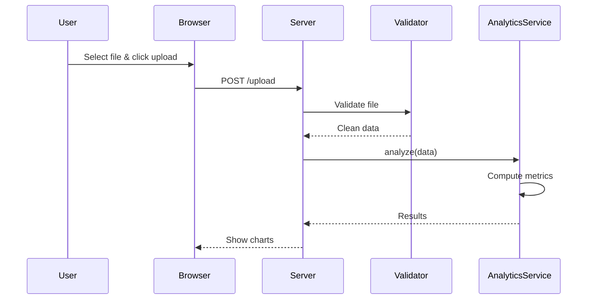

# Analytics Upload Sequence

The sequence below illustrates how an uploaded file is validated and processed to generate analytics results.

```mermaid
sequenceDiagram
    participant U as User
    participant B as Browser
    participant S as Server
    participant V as Validator
    participant AS as AnalyticsService

    U->>B: Select file & click upload
    B->>S: POST /upload
    S->>V: Validate file
    V-->>S: Clean data
    S->>AS: analyze(data)
    AS->>AS: Compute metrics
    AS-->>S: Results
    S-->>B: Show charts
```
