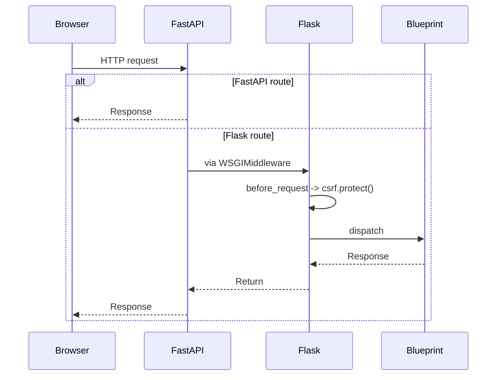

# API Documentation

The dashboard API combines legacy Flask routes with new FastAPI microservices.
A Swagger UI is available at `/api/docs` when the application is running. The
complete OpenAPI description lives in `api/openapi/yosai-api-v2.yaml` and can be
converted to JSON with:

```bash
go run ./api/openapi
```

This writes `docs/api/v2/openapi.json`. Once generated, this file can be served
by Swagger UI to display the API reference or used to generate client SDKs.

The CI workflow runs this command and uploads the generated `openapi.json` as an
artifact so the specification is available from workflow runs.


### FastAPI microservices

The analytics and event ingestion services are built with FastAPI. Each
service dumps its own OpenAPI description at startup under the
`docs/api/v2` directory. Regenerate these files along with the main spec by
running:

```bash
make docs
```

This command runs the Go generator and then imports both FastAPI services to
write `docs/analytics_microservice_openapi.json` and
`docs/event_ingestion_openapi.json`.

## Flask/FastAPI Adapter

Legacy dashboards still rely on Flask routes for file uploads and admin views.
`api/adapter.py` builds a Flask `app` and then mounts it inside the FastAPI
service using `WSGIMiddleware`. FastAPI handles its own routes first (such as
`/v1/analytics`) and forwards any remaining paths to the Flask app.

```python
from fastapi.middleware.wsgi import WSGIMiddleware

csrf.init_app(app)
service.app.mount("/", WSGIMiddleware(app))
```

### Request Flow

The sequence below illustrates how a request passes through the adapter and when
CSRF protection is enforced.




## API Versioning

All routes are grouped under a versioned prefix such as `/v1`.
Unversioned paths remain temporarily available for backward compatibility but
return a `Warning` header and are marked as deprecated. Future releases will
introduce `/v2` endpoints following the same pattern.
The Go `versioning` module provides `VersionManager` middleware that extracts
the version from the request path and attaches metadata to the context. The
manager can mark versions as `active`, `deprecated`, or `sunset` to control
behavior. Deprecated versions return a `Warning` header while sunset versions
return a `410 Gone` response.

## Database Connection Factory

### `DatabaseConnectionFactory`

Unified factory for creating database connections with pooling, retry logic,
health checks, async support, and Unicode-safe queries.

Configuration:

```yaml
database:
  type: postgresql
  pool_size: 20
  max_overflow: 40
  retries:
    attempts: 5
    backoff_seconds: 1.5
```

Usage:

```python
from yosai_intel_dashboard.src.infrastructure.database import (
    DatabaseConnectionFactory,
    DatabaseConfig,
)

config = DatabaseConfig(
    type="postgresql",
    pool_size=20,
    max_overflow=40,
    retry_attempts=5,
    retry_backoff=1.5,
)
factory = DatabaseConnectionFactory(config)

with factory.connection() as conn:
    conn.execute("SELECT 1")

async with factory.async_connection() as conn:
    await conn.execute("SELECT 1")

factory.health_check()
```

For local testing or development, set the `USE_MOCK_DB` environment variable to
force the factory to return a `MockDatabaseManager` instead of a real database
connection.

## Analytics Service

### `AnalyticsService`

Centralized analytics service for dashboard operations.

#### Methods

- `get_dashboard_summary() -> Dict[str, Any]`: Get dashboard overview
- `get_access_patterns_analysis(days) -> Dict[str, Any]`: Analyze access patterns
- `process_uploaded_file(contents, filename) -> Dict[str, Any]`: Validate and parse an uploaded file using `FileValidator.validate_file_upload`

## Models

### `AccessEvent`

Represents a single access control event.

#### Attributes

- `event_id: str`: Unique event identifier
- `timestamp: datetime`: When the event occurred
- `person_id: str`: Person attempting access
- `door_id: str`: Door being accessed
- `access_result: AccessResult`: Success/failure of access

## Service Container

`ServiceContainer` in `yosai_intel_dashboard.src.simple_di` offers a more capable
dependency injection mechanism. It resolves services by name and caches
instances created by registered factories.

```python
from yosai_intel_dashboard.src.simple_di import ServiceContainer
from yosai_intel_dashboard.src.infrastructure.database import DatabaseConnectionFactory

container = ServiceContainer()
container.register_factory("db", DatabaseConnectionFactory)

# Later in the code
if container.has("db"):
    db = container.get("db")
```

## Route Permissions

The following table lists the required role or permission for key API route groups.

| Route Prefix | Required Role | Required Permission |
|--------------|---------------|--------------------|
| `/admin` | `admin` | - |
| `/v1/analytics` | - | `analytics.read` |
| `/v1/events` | - | `events.write` |
| `/v1/doors` | - | `doors.control` |

For details on internal streaming, alert dispatching and WebSocket messages see
[Internal Service Interfaces](internal_services.md).

## Intel Analysis Service SDK

The Intel Analysis Service provides both REST and GraphQL interfaces. A basic
health check is available at `/status` while `/graphql` exposes a lightweight
schema suitable for interactive exploration or SDK generation. The service is
intended as a starting point for custom analytics features.
