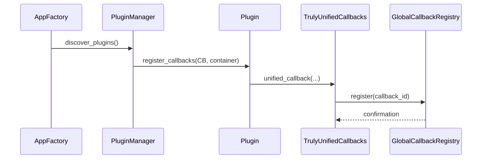

# Application Architecture

The dashboard is organized around a small core that wires together services and database models through a dependency injection (DI) container. The entry point is an application factory which creates the Dash/Flask app and registers all services.


1. **App Factory** – Initializes the Flask app and configures extensions.
2. **DI Container** – Provides application-wide services and resolves dependencies.
3. **Services** – Encapsulate business logic and rely on models for data access.
4. **Models** – Data representations loaded from or persisted to the database.
5. **Database** – PostgreSQL, SQLite, or a mock backend configured in `config/`.

The factory builds the container, which then instantiates services. Services operate on models retrieved from the database layer. This layered approach keeps components loosely coupled and easy to test.

See [React Component Architecture](react_component_architecture.md) for an overview of the front-end structure.

## Latest Changes

- **Validation Package** – Input and file checks are provided by the
  `validation` package. `SecurityValidator` and `FileValidator` can be
  composed from small rules. Legacy classes now import these validators
  for backward compatibility.
- **Separated Analytics Modules** – The previously monolithic
  `AnalyticsService` has been broken into smaller modules under
`services/data_processing/` and `analytics/`.  `UnifiedFileValidator`,
`Processor` and `AnalyticsEngine` handle file loading, cleaning and metric
generation while controllers manage UI callbacks.

The deprecated `DataLoader` and `DataLoadingService` modules have been
**removed**. Migrate any remaining code to use
`services.data_processing.processor.Processor` instead.

## Service Lookup

Common services like configuration and analytics are obtained from the DI
container. Register them during application startup and retrieve them where
needed:

```python
from config import create_config_manager
from core.container import Container
from services.analytics_service import create_analytics_service

container = Container()
container.register("config", create_config_manager())
container.register("analytics", create_analytics_service())

config_manager = container.get("config")  # ConfigurationProtocol
analytics_service = container.get("analytics")  # AnalyticsServiceProtocol
```

`create_config_manager()` automatically selects the YAML file to load based on
`YOSAI_ENV` or `YOSAI_CONFIG_FILE`. It can also be used directly:


```python
from config import create_config_manager

config = create_config_manager()
db_cfg = config.get_database_config()
```

The configuration system is split into small dataclasses such as
`AppConfig`, `DatabaseConfig`, `SecurityConfig` and more. The factory
`create_config_manager()` assembles these pieces and applies environment
overrides before returning a ready-to-use `ConfigManager` instance.

Both services implement protocols so alternative implementations can be swapped
in for tests or future extensions.

Additional interfaces such as `ExportServiceProtocol`, `UploadValidatorProtocol`
and `DoorMappingServiceProtocol` are defined in `services/interfaces.py`. When a
component does not receive a concrete instance it falls back to the global
`ServiceContainer` exposed on the Dash app.

## Service Container Registration

During initialization the factory builds the service container and registers core
services before any plugins are loaded.

```mermaid
graph TB
    A[App Factory] --> B[Create ServiceContainer]
    B --> C[register('config', ConfigManager)]
    B --> D[register('analytics', AnalyticsService)]
    B --> E[register('plugins', PluginManager)]
    E --> F[Discover Plugins]
    F --> G[register additional services]
```

## Plugin Lifecycle

Plugins follow a simple lifecycle once discovered by the plugin manager.

```mermaid
graph TB
    A[Discover Plugins] --> B[Resolve Dependencies]
    B --> C[load()]
    C --> D[configure()]
    D --> E[start()]
    E --> F[Plugin Running]
    F --> G[periodic health_check()]
    G --> F
```

## Callback Registration Sequence

The callback manager registers Dash callbacks and tracks them in the global
registry so plugins can avoid duplicate IDs.



## Threat Intelligence Integration

Security callbacks can subscribe to updates from `ThreatIntelligenceSystem`.
External feeds are gathered asynchronously and correlated with internal
logs.  When suspicious patterns are found the
`AutomatedResponseOrchestrator` queues response actions using the global
`task_queue`.  Callback handlers may listen for these queued actions and
respond accordingly.
