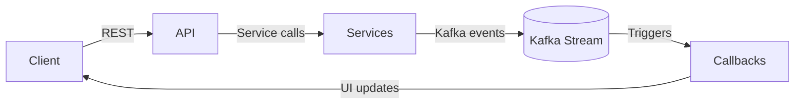

# Cross-Service Data Flow

This diagram outlines how the API, service layer and callback module exchange
data through REST and Kafka streams.

```mermaid
flowchart LR
    Client -->|REST| API
    API -->|Service calls| Services
    Services -->|Kafka events| Kafka[(Kafka Stream)]
    Kafka -->|Triggers| Callbacks
    Callbacks -->|UI updates| Client
```
