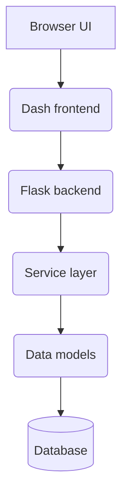
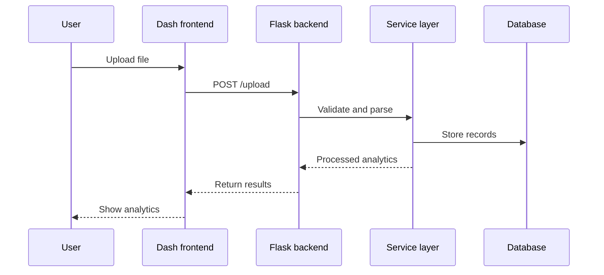

# Additional Architecture Diagrams

These diagrams complement `architecture.md` by illustrating component interactions and a typical data flow.

## Component Interaction

## Upload Processing Sequence

