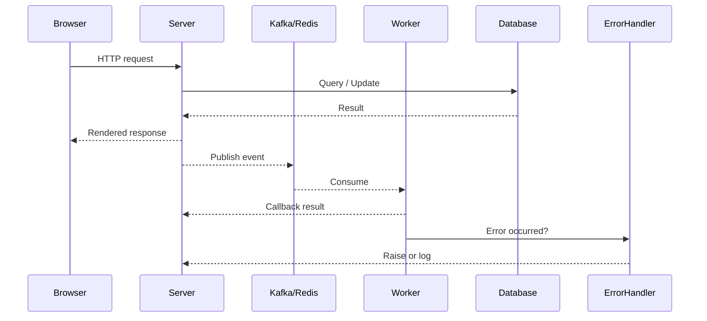

# Data Flow Overview

For the big-picture service layout, refer to the [System Diagram](system_diagram.md).

## Retry Logic and Circuit Breakers

Services publish events using `with_retry` and `CircuitBreaker` from
`core.error_handling`. Retries use exponential backoff and failures increment the
circuit breaker metrics. When a breaker opens, subsequent messages are rejected
and the error handler notifies the caller so issues surface quickly.
