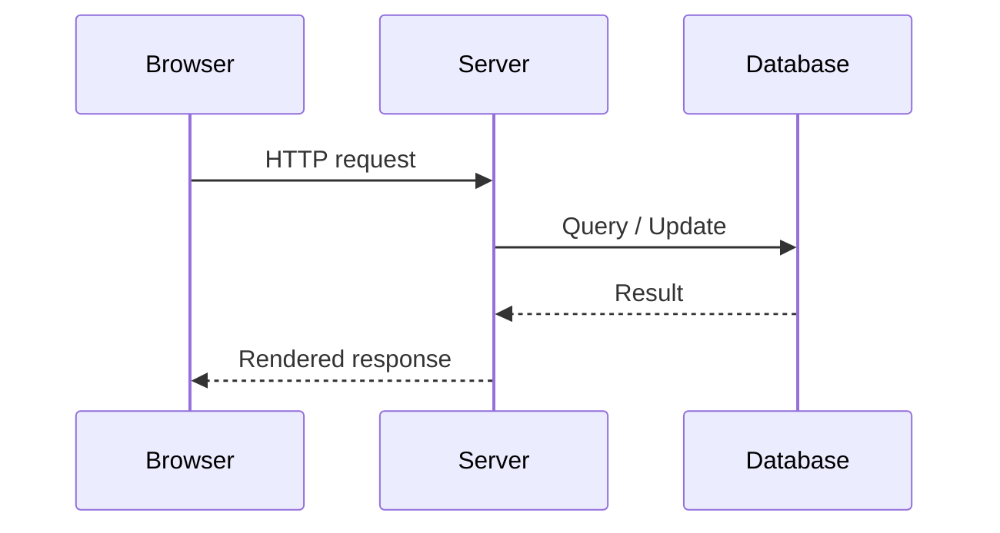

# Data Flow Overview

```mermaid
sequenceDiagram
    participant Browser
    participant Server
    participant DB as Database

    Browser->>Server: HTTP request
    Server->>DB: Query / Update
    DB-->>Server: Result
    Server-->>Browser: Rendered response
```
