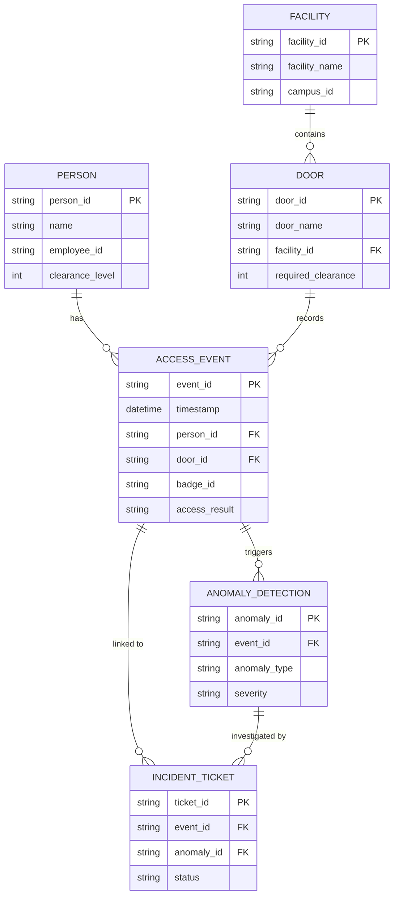

# Data Model

Core entities and relationships in the Yōsai Intel system.

```mermaid
erDiagram
    PERSON {
        string person_id PK
        string name
        string employee_id
        int clearance_level
    }
    DOOR {
        string door_id PK
        string door_name
        string facility_id FK
        int required_clearance
    }
    FACILITY {
        string facility_id PK
        string facility_name
        string campus_id
    }
    ACCESS_EVENT {
        string event_id PK
        datetime timestamp
        string person_id FK
        string door_id FK
        string badge_id
        string access_result
    }
    ANOMALY_DETECTION {
        string anomaly_id PK
        string event_id FK
        string anomaly_type
        string severity
    }
    INCIDENT_TICKET {
        string ticket_id PK
        string event_id FK
        string anomaly_id FK
        string status
    }

    PERSON ||--o{ ACCESS_EVENT : "has"
    DOOR ||--o{ ACCESS_EVENT : "records"
    FACILITY ||--o{ DOOR : "contains"
    ACCESS_EVENT ||--o{ ANOMALY_DETECTION : "triggers"
    ACCESS_EVENT ||--o{ INCIDENT_TICKET : "linked to"
    ANOMALY_DETECTION ||--o{ INCIDENT_TICKET : "investigated by"
```
