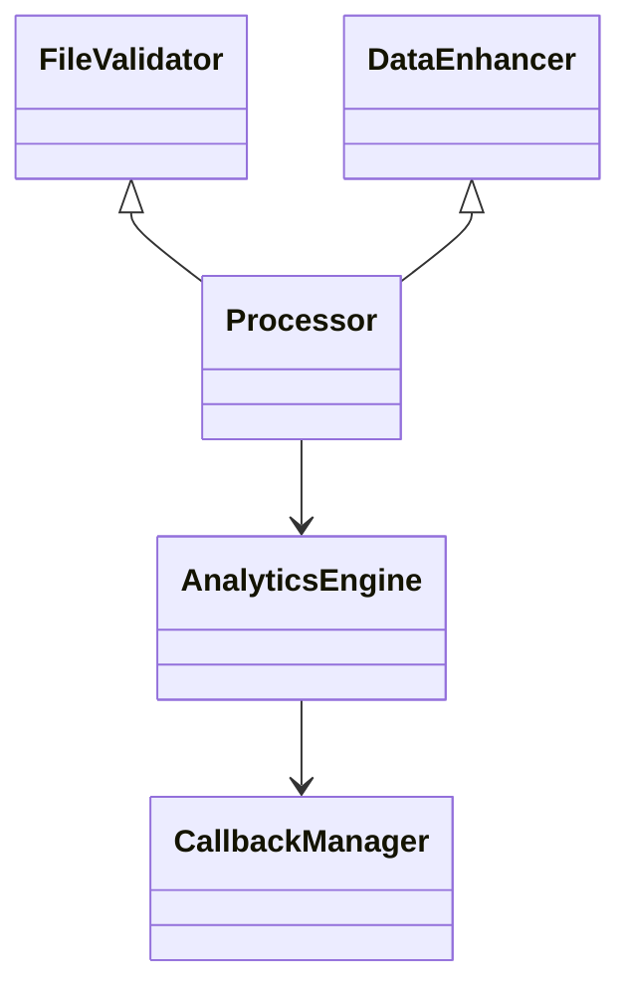

# Data Processing Services

The `services/data_processing/` directory contains the building blocks for uploading, enhancing and analysing raw data.  Each class focuses on a single responsibility so they can be combined in different pipelines.

## Directory Layout

```
services/
  data_processing/
      file_processor.py     # Validate and parse uploads
      processor.py          # Coordinate validation and enhancement
      data_enhancer/        # Data enhancer package
      analytics_engine.py   # Produce charts and metrics
```

## Core Classes

- **`FileValidator`** – Applies composable rules to uploaded files.
- **`DataEnhancer`** – Applies normalisation and adds computed columns.
- **`Processor`** – High level wrapper that uses `FileValidator` and `DataEnhancer` to produce a clean dataframe.
- **`AnalyticsEngine`** – Generates statistics from the processed dataframe.
- **``core.truly_unified_callbacks.TrulyUnifiedCallbacks``** – Emits events throughout the pipeline so plugins can react.

## Relationships



This separation makes the pipeline extensible and easier to test as new data sources are added.

Example event:
```python
from core.truly_unified_callbacks import TrulyUnifiedCallbacks
from core.callback_events import CallbackEvent

manager = TrulyUnifiedCallbacks()
manager.trigger_event(
    CallbackEvent.FILE_UPLOAD_COMPLETE,
    "uploader",
    {"rows": len(df)},
)
```
