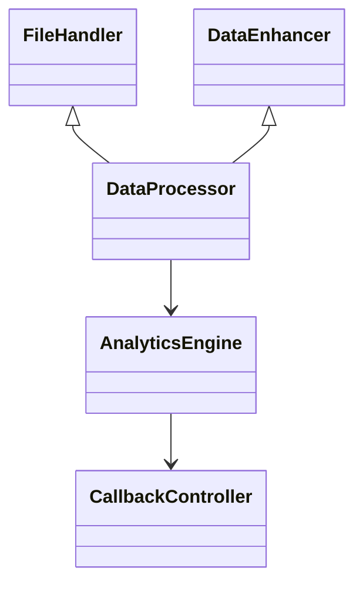

# Data Processing Services

The `services/data_processing/` directory contains the building blocks for uploading, enhancing and analysing raw data.  Each class focuses on a single responsibility so they can be combined in different pipelines.

## Directory Layout

```
services/
  data_processing/
      file_handler.py       # Validate and parse uploads
      data_enhancer.py      # Enrich DataFrame columns
      data_processor.py     # Coordinate file handling and enhancement
      analytics_engine.py   # Produce charts and metrics
```

## Core Classes

- **`FileHandler`** – Reads CSV/JSON/Excel files and performs validation.
- **`DataEnhancer`** – Applies normalisation and adds computed columns.
- **`DataProcessor`** – High level wrapper that uses `FileHandler` and `DataEnhancer` to produce a clean dataframe.
- **`AnalyticsEngine`** – Generates statistics from the processed dataframe.
- **`CallbackController`** – Emits events throughout the pipeline so plugins can react.

## Relationships



This separation makes the pipeline extensible and easier to test as new data sources are added.
