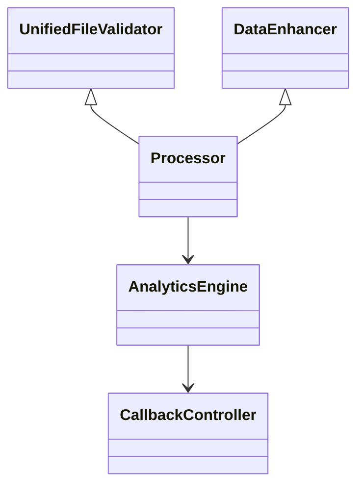

# Data Processing Services

The `services/data_processing/` directory contains the building blocks for uploading, enhancing and analysing raw data.  Each class focuses on a single responsibility so they can be combined in different pipelines.

## Directory Layout

```
services/
  data_processing/
      file_processor.py     # Validate and parse uploads
      processor.py          # Coordinate validation and enhancement
      data_enhancer.py      # Enrich DataFrame columns
      analytics_engine.py   # Produce charts and metrics
```

## Core Classes

- **`UnifiedFileValidator`** – Reads CSV/JSON/Excel files and performs validation.
- **`DataEnhancer`** – Applies normalisation and adds computed columns.
- **`Processor`** – High level wrapper that uses `UnifiedFileValidator` and `DataEnhancer` to produce a clean dataframe.
- **`AnalyticsEngine`** – Generates statistics from the processed dataframe.
- **``core.callback_manager.CallbackManager``** – Emits events throughout the pipeline so plugins can react.

## Relationships



This separation makes the pipeline extensible and easier to test as new data sources are added.

Example event:
```python
from core.callback_manager import CallbackManager
from core.callback_events import CallbackEvent

manager = CallbackManager()
manager.trigger(CallbackEvent.FILE_UPLOAD_COMPLETE, "uploader", {"rows": len(df)})
```
