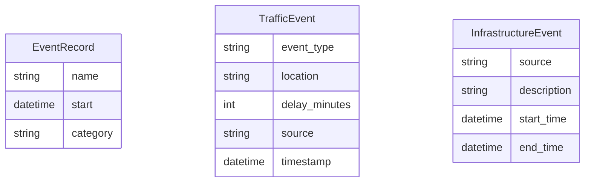

# Database Schema Overview

This document summarises the lightweight in-memory schemas used by the dashboard and the indexing strategies applied for efficient queries.

## Entity Relationship Diagram

The diagram below reflects the structures defined in `yosai_intel_dashboard/src/database` and was generated from the dataclass definitions in `migrations.py`.

## Normalization

Each table contains atomic values and has a clear primary key candidate, meeting third normal form. The separation of event types avoids update anomalies and keeps the schema extensible.

## Indexing Strategy

- **Events**: events are indexed by `category` to support frequent category filtering.
- **Transport Events**: transport events maintain an index by `location` for fast lookup and aggregation.

These in-memory indexes provide near constant-time access without the overhead of scanning entire collections, aligning the implementation with common database indexing practices.
