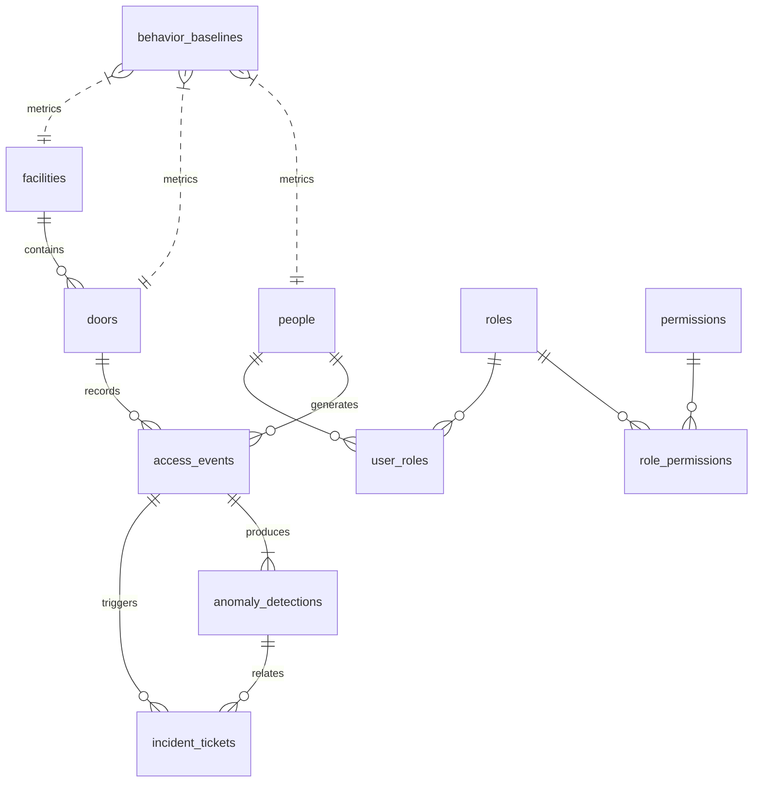

# Database Table Relationships

```mermaid
erDiagram
    facilities ||--o{ doors : contains
    doors ||--o{ access_events : records
    people ||--o{ access_events : generates
    access_events ||--|{ anomaly_detections : produces
    access_events ||--o{ incident_tickets : triggers
    anomaly_detections ||--o{ incident_tickets : relates
    roles ||--o{ role_permissions : ""
    permissions ||--o{ role_permissions : ""
    roles ||--o{ user_roles : ""
    people ||--o{ user_roles : ""
    behavior_baselines }|..|| people : metrics
    behavior_baselines }|..|| doors : metrics
    behavior_baselines }|..|| facilities : metrics
```
