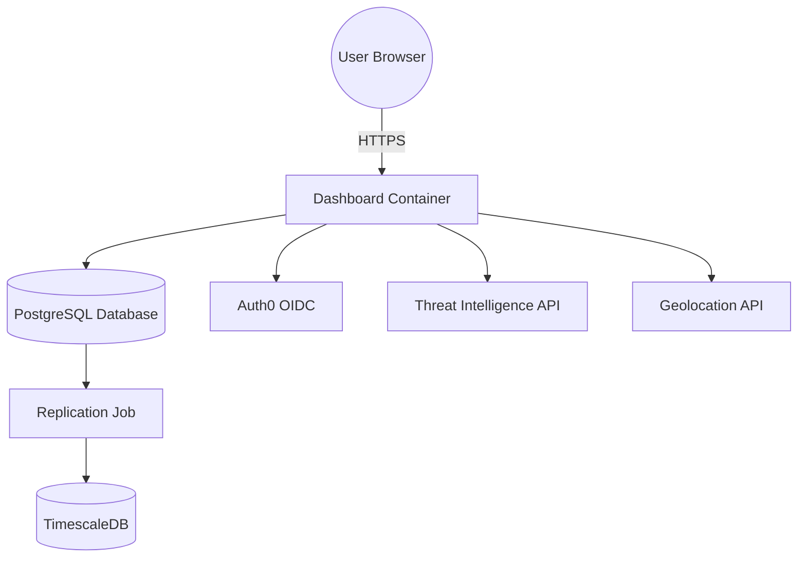

# Deployment Diagram

This diagram illustrates how the dashboard container interacts with its database and external services.

The migration layer uses **Alembic** to manage schema changes. A lightweight replication job keeps the TimescaleDB instance in sync by polling PostgreSQL for new events.
