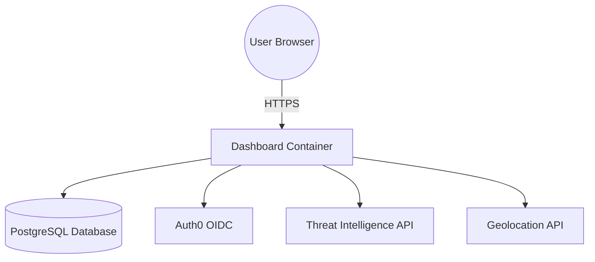

# Deployment Diagram

This diagram illustrates how the dashboard container interacts with its database and external services.

```mermaid
flowchart TD
    Browser((User Browser)) -->|HTTPS| Dashboard["Dashboard Container"]
    Dashboard --> Postgres[(PostgreSQL Database)]
    Dashboard --> Auth0["Auth0 OIDC"]
    Dashboard --> ThreatIntel["Threat Intelligence API"]
    Dashboard --> GeoAPI["Geolocation API"]
```
