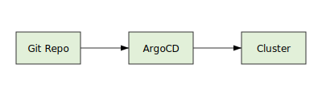

# Deployment Guide

This guide describes how to install ArgoCD, apply Helm charts, and verify deployments for the dashboard.



## Prerequisites

- A Kubernetes cluster with `kubectl` configured
- [Helm](https://helm.sh/) installed locally
- Access to the Git repository containing the Helm charts

## Image Vulnerability Scan

The CI pipeline scans every published container image with `trivy image` and uploads a SARIF report. Deployments should proceed only after the scan job succeeds without critical findings in the workflow.

## Install ArgoCD

1. Create the ArgoCD namespace:
   ```bash
   kubectl create namespace argocd
   ```
2. Install ArgoCD using the official manifests:
   ```bash
   kubectl apply -n argocd -f https://raw.githubusercontent.com/argoproj/argo-cd/stable/manifests/install.yaml
   ```
3. Expose the ArgoCD API server (optionally via a LoadBalancer or port-forward) and log in:
   ```bash
   kubectl port-forward svc/argocd-server -n argocd 8080:443
   argocd login localhost:8080 --username admin --password <initial-password>
   ```

## Apply Helm Charts

1. Add the chart repository and update:
   ```bash
   helm repo add yosai https://example.com/charts
   helm repo update
   ```
2. Create an ArgoCD application pointing at the chart and Git repository:
   ```bash
   argocd app create yosai-dashboard \
     --repo https://github.com/WSG23/yosai_intel_dashboard_fresh.git \
     --path helm/chart \
     --dest-server https://kubernetes.default.svc \
     --dest-namespace default
   ```
3. Sync the application to install the release:
   ```bash
   argocd app sync yosai-dashboard
   ```

## Verify Deployments

1. Check that all pods are running:
   ```bash
   kubectl get pods -n default
   ```
2. Confirm the ArgoCD application is healthy:
   ```bash
   argocd app list
   argocd app get yosai-dashboard
   ```
3. Verify services respond as expected by inspecting logs or accessing exposed endpoints.
4. Confirm the API health endpoint responds:
   ```bash
   curl -f http://<service-host>:5001/health
   ```

