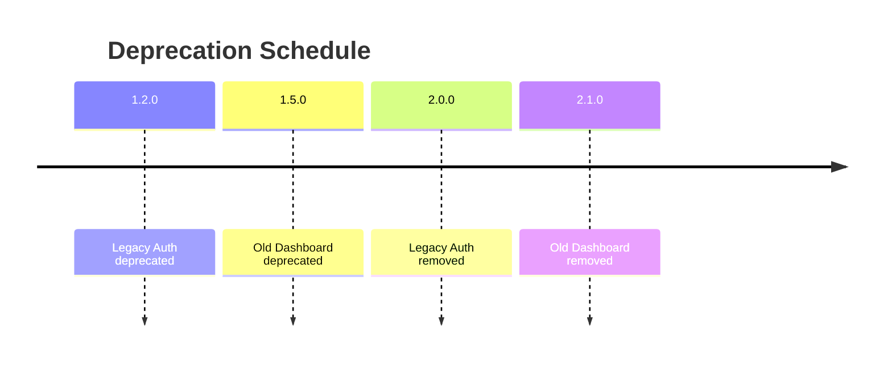

# Deprecation Timeline

This document summarizes features scheduled for removal and links to their migration guides. All data is sourced from `deprecation.yml`.

## Summary

| Component | Deprecated Since | Removal Version | Migration Guide |
|-----------|-----------------|-----------------|----------------|
| legacy-auth | 1.2.0 | 2.0.0 | [Legacy Auth Migration](migration/legacy-auth.md) |
| old-dashboard | 1.5.0 | 2.1.0 | [New Dashboard Migration](migration/new-dashboard.md) |

- [Legacy Auth Migration](migration/legacy-auth.md)
- [New Dashboard Migration](migration/new-dashboard.md)




## Component Guides

### Legacy Auth

The legacy authentication system relied on custom Flask blueprints and has been replaced by a unified authentication service.

**Before**

```python
from legacy_auth import login_user
user = login_user(username, password)
```

**After**

```python
from services.auth_service import AuthService

auth = AuthService()
user = auth.login(username, password)
```

### Old Dashboard

The original dashboard interface has been superseded by a React-based frontend served from `ui/dist`.

**Before**

```python
@app.route("/dashboard")
def dashboard():
    return render_template("dashboard.html")
```

**After**

```python
from flask import send_from_directory

@app.route("/dashboard")
def dashboard():
    return send_from_directory("ui/dist", "index.html")
```

## Enabling Deprecation Warnings

The `deprecated` decorator emits `DeprecationWarning`, which Python hides by default. To surface these warnings during development, enable them with an environment variable or runtime flag:

```bash
export PYTHONWARNINGS=default
# or
python -Wd start_api.py
```

With warnings enabled, calls to deprecated APIs will display helpful messages indicating upcoming removals.

