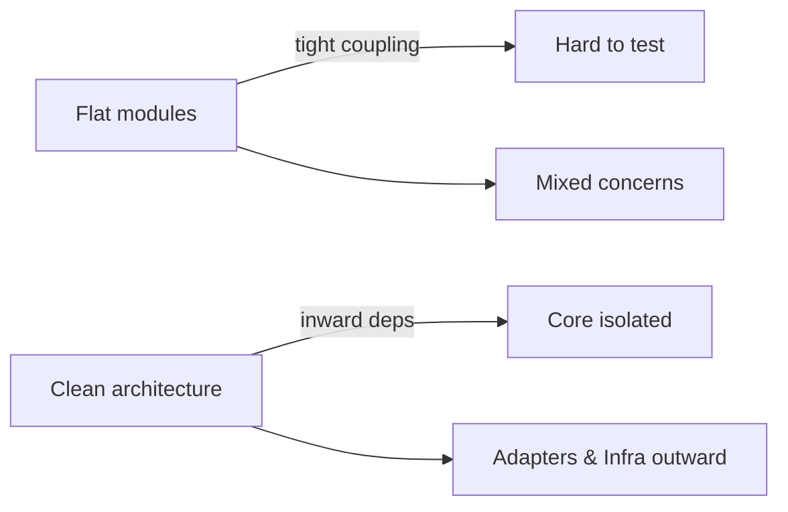

# Clean Architecture Migration Guide

## 1. Overview

Clean Architecture organizes code into concentric layers where dependencies point inward. Entities and use cases sit at the core, while adapters and infrastructure live on the outside. This project migrated from a flat module tree to this layered structure under `yosai_intel_dashboard/src/`, as shown in the directory overview documentation【F:docs/clean_architecture_structure.md†L3-L29】.

### Why We Migrated
- **Testability**: Isolated business rules make unit tests straightforward.
- **Maintainability**: Clear boundaries prevent accidental cross‑layer coupling.
- **Scalability**: Features grow without tangling framework code with domain logic.

### Before vs. After


| Old Structure | New Structure |
|---------------|---------------|
| `models/`, `services/`, `config/` at repo root | Layered under `yosai_intel_dashboard/src/` (`core`, `adapters`, `infrastructure`, `services`) |

Key migration outcome: a unified callback system using **TrulyUnifiedCallbacks**; legacy coordinators were removed in favor of this consolidated API【F:docs/migration_callback_system.md†L1-L16】.

## Related Architectural Decisions

- [ADR 0001: BaseComponent](adr/0001-base-component.md)
- [ADR 0002: ConfigService](adr/0002-config-service.md)
- [ADR 0003: EventBus](adr/0003-event-bus.md)
- [ADR 0004: Repository Pattern](adr/0004-repository-pattern.md)
- [ADR 0005: Mixins](adr/0005-mixins.md)

## 2. Import Migration Guide

| Old Import | New Import | Notes |
|------------|------------|-------|
| `from models.user import User` | `from yosai_intel_dashboard.src.core.domain.entities.user import User` | Symlink available |
| `from yosai_intel_dashboard.src.services.analytics import AnalyticsService` | Use direct import | Symlink removed |
| `from yosai_intel_dashboard.src.infrastructure.config.settings import SETTINGS` | `from yosai_intel_dashboard.src.infrastructure.config.settings import SETTINGS` | Symlink available |
| `from yosai_intel_dashboard.src.infrastructure.monitoring.metrics import record_metric` | `from yosai_intel_dashboard.src.infrastructure.monitoring.metrics import record_metric` | Symlink available |
| `from yosai_intel_dashboard.src.infrastructure.security.auth import AuthManager` | `from yosai_intel_dashboard.src.infrastructure.security.auth import AuthManager` | Symlink available |
| `from validation.validators import validate` | `from yosai_intel_dashboard.src.infrastructure.validation.validators import validate` | Symlink available |
| `from yosai_intel_dashboard.src.adapters.api.router import router` | `from yosai_intel_dashboard.src.adapters.api.router import router` | Symlink available |
| `from components.table import DataTable` | `from yosai_intel_dashboard.src.adapters.ui.components.table import DataTable` | Symlink available |
| `from pages.dashboard import DashboardPage` | `from yosai_intel_dashboard.src.adapters.ui.pages.dashboard import DashboardPage` | Symlink available |
| `from core.use_cases.process import ProcessUseCase` | `from yosai_intel_dashboard.src.core.use_cases.process import ProcessUseCase` | Symlink available |

## 3. Code Migration Examples

### Creating a New Feature
Before:
```python
# analytics/user_stats.py
from yosai_intel_dashboard.src.services.user_service import fetch_users

def top_users():
    data = fetch_users()
    return sorted(data, key=lambda u: u.score)[:10]
```
After:
```python
# yosai_intel_dashboard/src/core/use_cases/user_stats.py
from yosai_intel_dashboard.src.core.interfaces.user_repo import UserRepo

class GetTopUsers:
    def __init__(self, repo: UserRepo):
        self.repo = repo

    def __call__(self, limit: int = 10):
        users = self.repo.fetch_users()
        return sorted(users, key=lambda u: u.score)[:limit]
```
Pro tip: keep business logic in `core`; UI and frameworks belong in adapters or infrastructure.

### Adding a Service
Before:
```python
# services/reporting_service.py
from yosai_intel_dashboard.src.infrastructure.config.settings import SETTINGS
from models.report import Report
```
After:
```python
# yosai_intel_dashboard/src/services/reporting/service.py
from yosai_intel_dashboard.src.infrastructure.config.settings import SETTINGS
from yosai_intel_dashboard.src.core.domain.entities.report import Report
```
Pro tip: services compose use cases and infrastructure. They should not reach into UI code.

### Writing Tests
Before:
```python
# tests/test_user.py
from models.user import User
```
After:
```python
# tests/core/domain/entities/test_user.py
from yosai_intel_dashboard.src.core.domain.entities.user import User
```
Pro tip: mirror the `src/` hierarchy under `tests/` for clarity and coverage.

### Dependency Injection
Before:
```python
from yosai_intel_dashboard.src.services.user_service import UserService

svc = UserService()
```
After:
```python
from yosai_intel_dashboard.src.core.use_cases.user_stats import GetTopUsers
from yosai_intel_dashboard.src.adapters.persistence.user_repo_impl import UserRepoImpl

repo = UserRepoImpl()
get_top_users = GetTopUsers(repo)
```
Pro tip: inject dependencies explicitly—use constructors or lightweight containers.

## 4. Development Workflow
- Place domain entities and use cases in `core`.
- Put translation layers (REST, persistence, UI) in `adapters`.
- Keep framework or environment specifics in `infrastructure`.
- Build deployable pieces in `services`.
- Ensure dependencies only point inward; run `python scripts/validate_structure.py` in CI to confirm【F:scripts/validate_structure.py†L1-L35】.

## 5. Testing Guide
- Align tests with the layer under test; core tests should not import infrastructure.
- Mock outward dependencies; use fixtures to supply interfaces.
- For integration tests, compose adapters and infrastructure around core use cases.
- 344 test files exist; 198 still reference legacy imports, so refactor gradually as modules move【F:STEP_20_FINAL_ACCURATE.md†L5-L8】.

## 6. Common Pitfalls
- **Circular dependencies**: keep interfaces in `core.interfaces` and inject implementations from outer layers.
- **Wrong layer calls**: infrastructure must never import from service packages; core must not depend on adapters.
- **Anti‑patterns**: avoid global singletons and direct database calls inside use cases.

## 7. Gradual Migration Strategy
- Compatibility symlinks allow old imports to function during transition.
- Migrate module by module: move code, update imports, run tests.
- Remove symlinks once all imports use the new paths and CI passes.

## 8. Tools and Scripts
- **validate_structure.py** – checks required directories and verifies clean architecture layout【F:scripts/validate_structure.py†L1-L35】.
- **verify_imports.py** – scans for legacy import patterns; run `python scripts/verify_imports.py <paths>` to confirm only new paths are used【F:scripts/verify_imports.py†L1-L34】.
- **create_symlinks.py** – regenerates compatibility symlinks if they are removed or when new modules are added; use during partial migrations.

## 9. FAQ
- **Why can’t I import infrastructure from core?** Core must remain framework‑agnostic to keep tests fast and logic portable.
- **Where do DTOs go?** Place serializable request/response objects in `core.interfaces` or under adapters if they are transport‑specific.
- **How do I handle cross‑cutting concerns?** Use infrastructure modules (e.g., monitoring, security) and inject them where needed.
- **When will symlinks be removed?** After all legacy imports are updated and teams signal readiness.

## 10. Cheat Sheet
- **Layer dependencies**: `infrastructure → adapters → core`; services compose all layers.
- **Common imports**:
  - `from yosai_intel_dashboard.src.core.domain.entities.<entity>`
  - `from yosai_intel_dashboard.src.core.use_cases.<use_case>`
  - `from yosai_intel_dashboard.src.adapters.api.<module>`
- **File organization**:
  - Domain logic in `core/`
  - Framework glue in `adapters/`
  - External services in `infrastructure/`
  - Deployment code in `services/`

Happy migrating! Remember to commit small, tested steps and rely on the helper scripts for smooth transitions.

