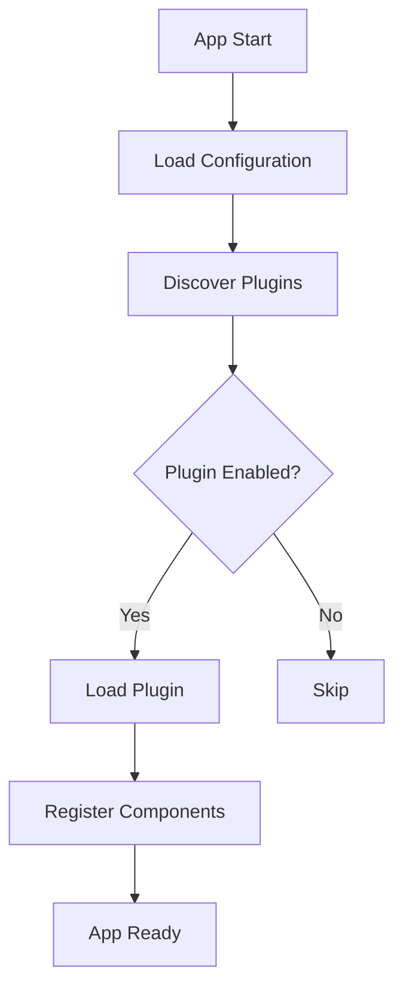

# Plugin Architecture

```mermaid
graph TD
    A[App Start] --> B[Load Configuration]
    B --> C[Discover Plugins]
    C --> D{Plugin Enabled?}
    D -->|Yes| E[Load Plugin]
    D -->|No| F[Skip]
    E --> G[Register Components]
    G --> H[App Ready]
```
