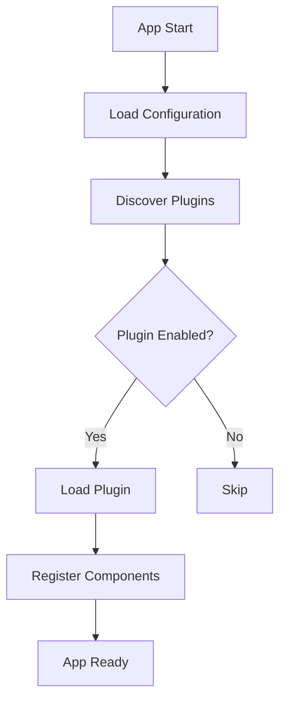

# Plugins

This document provides a practical overview of how to create and register plugins in the Yōsai Intel Dashboard. Plugins extend the dashboard at runtime by registering services and callbacks.

## Architecture Overview



Plugins live in the `plugins/` directory by default. The `PluginManager` scans this package and imports every submodule. Each module must expose a `create_plugin()` function, a `plugin` instance or an `init_plugin(container, config)` function returning an object implementing `PluginProtocol`.

You can change the search location by passing a different package name to `PluginManager(package="myplugins")`. Set `fail_fast=True` if plugin import errors should halt startup instead of only being logged.

## Creating a Plugin

1. **Create a package** under `plugins/`:

   ```bash
   mkdir plugins/example
   ```

2. **Implement the plugin** in `plugins/example/plugin.py`:

   ```python
   from dataclasses import dataclass
   from dash import Input, Output
   from dash.exceptions import PreventUpdate

   from yosai_intel_dashboard.src.core.protocols.plugin import CallbackPluginProtocol, PluginMetadata


   @dataclass
   class ExampleConfig:
       greeting: str = "Hello"


   class ExamplePlugin(CallbackPluginProtocol):
       metadata = PluginMetadata(
           name="example",
           version="1.0.0",
           description="Minimal example plugin",
           author="Example",
       )

       def __init__(self) -> None:
           self.service: GreetingService | None = None

       def load(self, container, config: dict) -> bool:
           self.service = GreetingService(config.get("greeting", "Hello"))
           container.register("greeting_service", self.service)
           return True

       def configure(self, config: dict) -> bool:
           return True

       def start(self) -> bool:
           return True

       def stop(self) -> bool:
           return True

       def health_check(self) -> dict:
           return {"healthy": True}

       def register_callbacks(self, manager, container) -> bool:
           svc: GreetingService = container.get("greeting_service")

           @manager.unified_callback(
               Output("greet-output", "children"),
               Input("name-input", "value"),
               callback_id="example_greet",
               component_name="example_plugin",
           )
           def _greet(name):
               if not name:
                   raise PreventUpdate
               return svc.greet(name)

           return True


   def create_plugin() -> "ExamplePlugin":
       return ExamplePlugin()
   ```

   The `load()` method registers a service with the DI container. Callbacks retrieve that service back from the container.

3. **Enable the plugin** in `core/plugins/config/plugins.yaml`:

   ```yaml
   example:
     enabled: true
   ```

4. **Initialize plugins** during app start up:

   ```python
   from yosai_intel_dashboard.src.core.plugins.auto_config import setup_plugins

   app = Dash(__name__)
   registry = setup_plugins(app)
   ```

## Lifecycle

```mermaid
graph TB
    A[Discover Plugins] --> B[Resolve Dependencies]
    B --> C[load()]
    C --> D[configure()]
    D --> E[start()]
    E --> F[Plugin Running]
    F --> G[periodic health_check()]
    G --> F
```

For each enabled plugin the manager calls these methods in order:

1. `load(container, config)` – register services with the DI container.
2. `configure(config)` – apply configuration values.
3. `start()` – perform any runtime initialisation.
4. `register_callbacks(manager, container)` – hook into Dash if implemented.

The helper function `setup_plugins(app)` loads every enabled plugin, registers callbacks, exposes `/health/plugins` and attaches the plugin manager as `app._yosai_plugin_manager`.

## Circular dependencies

Plugins should avoid depending on each other in a cycle. If the dependency resolver detects such a cycle the manager logs a message like:

```text
ERROR - Plugin dependency cycle detected: Circular dependency detected among: a, b
```

None of the involved plugins will be loaded. Check the logged plugin names and update their `dependencies` lists to remove the cycle.

