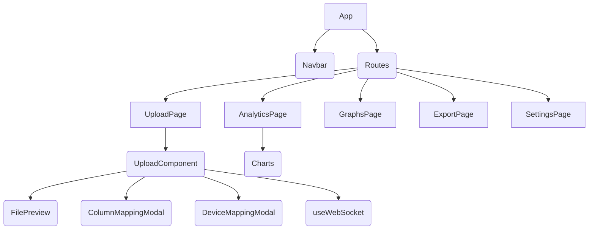

# React Component Architecture

The front‑end is written in **React** and organized into feature pages under
`src/pages`. Shared UI elements live in `src/components` alongside a few utility
hooks. Each page loads data from the API and manages its own state using React
hooks.

## Pages

- **Upload** – drag‑and‑drop uploads with column and device mapping modals
  (`src/pages/Upload.tsx`).
- **Analytics** – interactive charts and pattern summaries
  (`src/pages/Analytics.tsx`).
- **Graphs** – additional visualizations (`src/pages/Graphs.tsx`).
- **Export** – download processed results (`src/pages/Export.tsx`).
- **Settings** – application preferences (`src/pages/Settings.tsx`).

Navigation between pages is handled by the **Navbar** component
(`src/components/layout/Navbar.tsx`) which uses `react-router-dom`.

## Shared Components

Reusable widgets such as `Button`, `Card`, `Input` and `ProgressBar` are defined
in `src/components/shared`. Complex upload functionality is split into smaller
components under `src/components/upload` (for example
`FilePreview` and `ColumnMappingModal`). Layout helpers like `Navbar` and the
optional `Sidebar` live under `src/components/layout`.

## Hooks

Custom hooks live in `src/hooks`. Currently `useWebSocket` provides a simple way
to subscribe to server‑sent progress updates during uploads. Pages primarily use
`useState` and `useEffect` for local state management.

## Data Flow

Pages communicate with the backend via the `apiClient` wrapper in
`src/api/client.ts`. API calls return JSON which pages store in component state.
During file uploads the UI opens a WebSocket connection to receive progress
updates while the file is processed.

## Component Hierarchy

Each page maintains its own slice of state; children update parent state via
callbacks. The upload flow, for example, stores selected files in `Upload` and
passes progress information down to `FilePreview` components.
