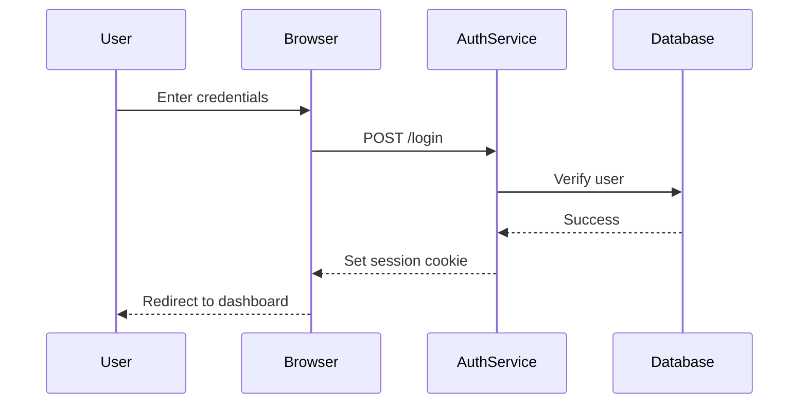
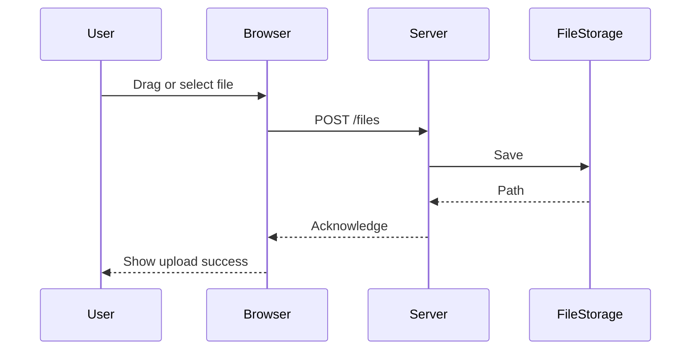
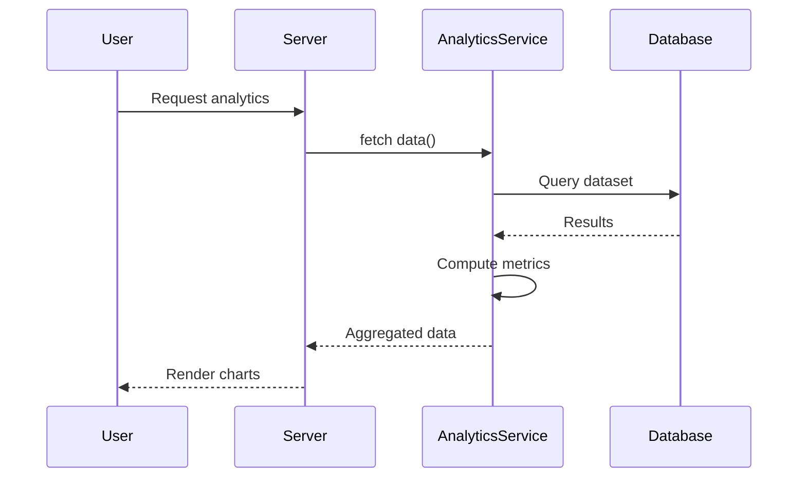

# Sequence Diagrams

The following mermaid diagrams illustrate key interactions in the system.

## User Login

```mermaid
sequenceDiagram
    participant U as User
    participant B as Browser
    participant A as AuthService
    participant DB as Database

    U->>B: Enter credentials
    B->>A: POST /login
    A->>DB: Verify user
    DB-->>A: Success
    A-->>B: Set session cookie
    B-->>U: Redirect to dashboard
```

## File Upload

```mermaid
sequenceDiagram
    participant U as User
    participant B as Browser
    participant S as Server
    participant FS as FileStorage

    U->>B: Drag or select file
    B->>S: POST /files
    S->>FS: Save
    FS-->>S: Path
    S-->>B: Acknowledge
    B-->>U: Show upload success
```

## Analytics Generation

```mermaid
sequenceDiagram
    participant U as User
    participant S as Server
    participant AS as AnalyticsService
    participant DB as Database

    U->>S: Request analytics
    S->>AS: fetch data()
    AS->>DB: Query dataset
    DB-->>AS: Results
    AS->>AS: Compute metrics
    AS-->>S: Aggregated data
    S-->>U: Render charts
```
