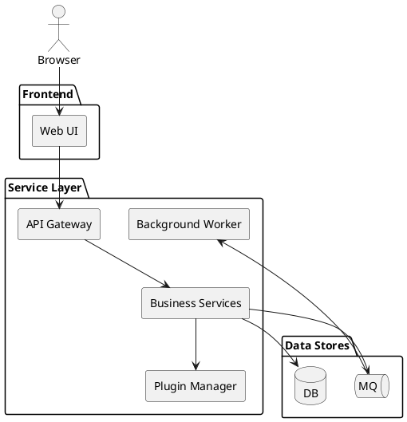

# System Diagram

This document outlines the high-level components of the platform and how they communicate. It serves as an entry point; for a deeper look at the application layering see [Architecture](architecture.md) and for runtime messaging refer to [Data Flow](data_flow.md). The PlantUML source for this diagram is available in [system_diagram.puml](system_diagram.puml).

The diagram highlights the service boundaries: the Web UI issues HTTP calls to the API gateway, services encapsulate business logic and plugin management, and data persists through the database or flows asynchronously via the message queue to background workers.

For additional context see the [Architecture](architecture.md) and [Data Flow](data_flow.md) documents which provide more detailed design and sequence information.
