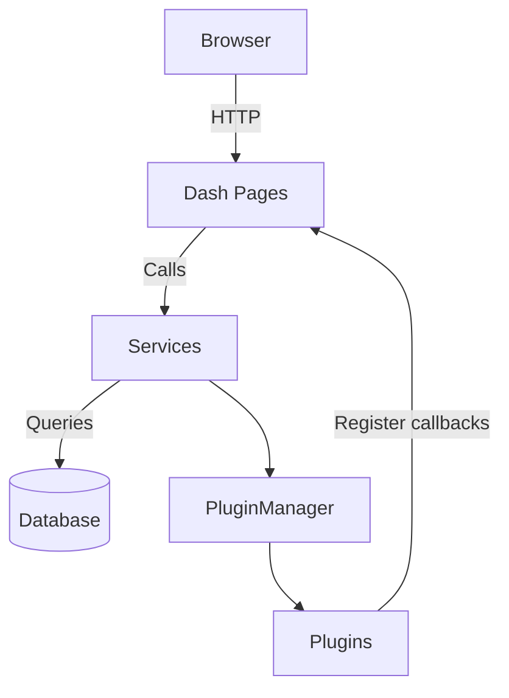

# System Flow Diagram

This diagram illustrates how the Dash pages interact with the service layer, plugins, and the database.

```mermaid
flowchart TD
    Browser -->|HTTP| Pages["Dash Pages"]
    Pages -->|Calls| Services
    Services -->|Queries| DB[(Database)]
    Services --> PluginManager
    PluginManager --> Plugins
    Plugins -->|Register callbacks| Pages
```

