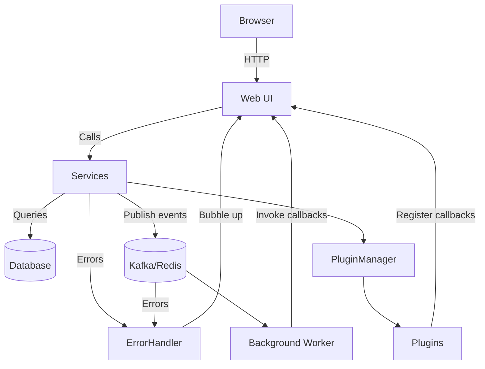

# System Flow Diagram

This diagram illustrates how the frontend interacts with the service layer, plugins,
the database and the asynchronous messaging components.

## Retry Logic and Circuit Breakers

The `core.error_handling` module provides a `CircuitBreaker` class and
`with_retry` decorator that wrap external calls. Services publish events to Kafka
or Redis through these utilities so that temporary failures are retried with
exponential backoff. When the breaker opens, further calls raise a
`CircuitBreakerError` which is captured by the global error handler and reported
back to the UI.

