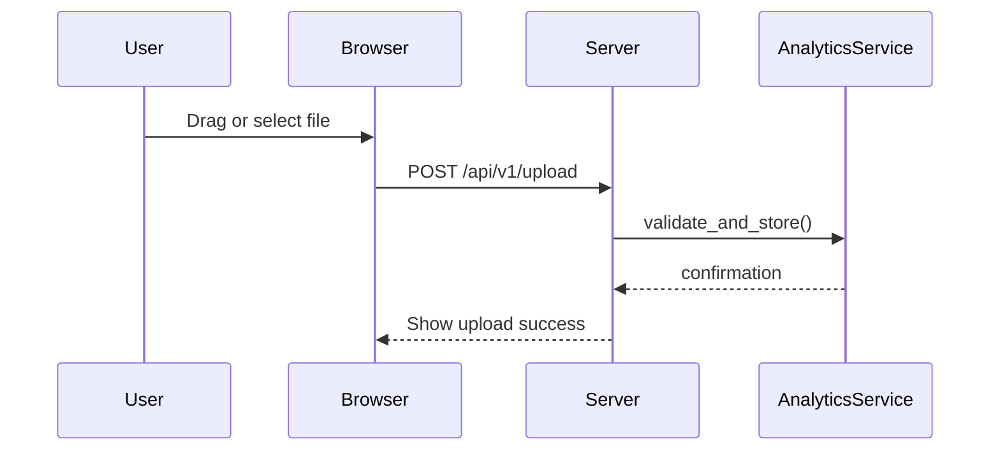
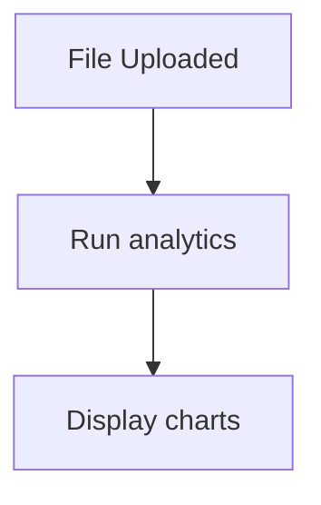
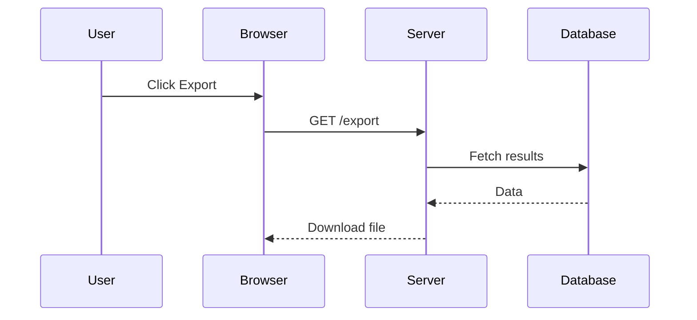

# UI Flows

This document illustrates the key interactions that users perform in the dashboard UI.
The focus is on the upload, analytics and export steps that most users follow.

## Upload a File

## Run Analytics

## Export Results

